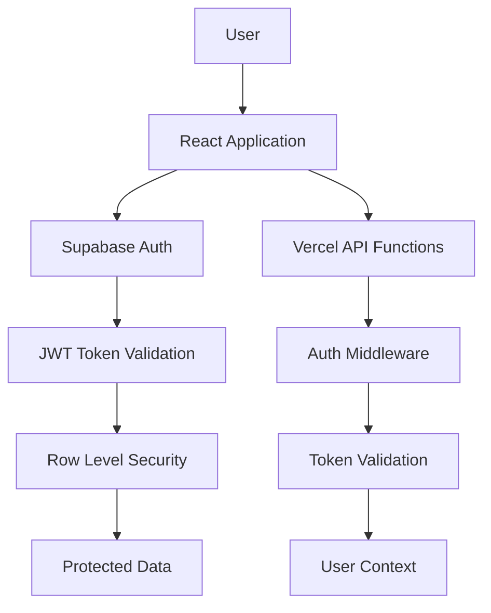

# Security Architecture Document

## Introduction

This document outlines the comprehensive security architecture for the Chicken Manager application, addressing authentication, authorization, data protection, and infrastructure security across the full technology stack.

**Project Context:**
- **Application Type:** Full-stack SaaS application for poultry farm management
- **Technology Stack:** React 19 + TypeScript + Supabase + Vercel
- **User Base:** Individual poultry farmers (multi-tenant)
- **Data Sensitivity:** Farm production data, financial records, customer information
- **Compliance Requirements:** Basic data protection (GDPR considerations)

## Security Architecture Overview

### Security Philosophy

**Defense in Depth:** Multiple layers of security controls across client, application, database, and infrastructure layers.

**Zero Trust Approach:** No implicit trust - verify every request, validate every input, authenticate every user action.

**Data-Centric Security:** Protection follows data throughout its lifecycle - in transit, at rest, and in use.

### Threat Model

**Primary Threats:**
1. **Unauthorized Data Access** - Users accessing other farmers' data
2. **Data Breaches** - External actors accessing sensitive farm/financial data  
3. **Account Takeover** - Malicious actors gaining user account control
4. **API Abuse** - Automated attacks against API endpoints
5. **Data Loss** - Accidental or malicious data deletion

**Attack Vectors:**
- Web application vulnerabilities (XSS, CSRF, injection)
- Authentication bypass attempts
- API endpoint enumeration and abuse
- Man-in-the-middle attacks
- Social engineering targeting users

## Authentication Architecture

### Multi-Layer Authentication



### Authentication Implementation

**Primary Authentication:** Supabase Auth with email/password
- **Token Type:** JWT with 1-hour expiration + automatic refresh
- **Storage:** HTTP-only cookies (secure) + localStorage fallback
- **Session Management:** Automatic token refresh in BaseApiService

**Authentication Flow:**
```typescript
// BaseApiService.ts authentication pattern
protected async getAuthHeaders(): Promise<Record<string, string>> {
  // 1. Get current session
  const { data: { session: initialSession }, error: sessionError } = 
    await supabase.auth.getSession();
  
  // 2. Auto-refresh if expired
  if (sessionError || !session || !session.access_token) {
    const { data: refreshData, error: refreshError } = 
      await supabase.auth.refreshSession();
    // Handle refresh logic
  }
  
  // 3. Return authenticated headers
  return {
    'Content-Type': 'application/json',
    'Authorization': `Bearer ${session.access_token}`
  };
}
```

### Session Security

**Token Security:**
- **Expiration:** 1-hour access token with automatic refresh
- **Scope:** User-specific with role-based permissions
- **Revocation:** Immediate logout on 401 responses
- **Rotation:** New tokens issued on each refresh

**Session Persistence:**
- **Primary:** Secure HTTP-only cookies (HTTPS only)
- **Fallback:** localStorage with encryption (for SPA requirements)
- **Cross-tab sync:** Supabase handles session synchronization

## Authorization Architecture

### Row Level Security (RLS)

**Database-Level Authorization:**
Every data table enforces user-specific access through PostgreSQL RLS policies.

```sql
-- Example RLS Policy (Egg Entries)
CREATE POLICY "Users can only access their own egg entries"
ON egg_entries FOR ALL
TO authenticated
USING (auth.uid() = user_id);

-- Example RLS Policy (Customers) 
CREATE POLICY "Users can only access their own customers"
ON customers FOR ALL  
TO authenticated
USING (auth.uid() = user_id);
```

**Multi-Tenant Data Isolation:**
- **User ID Column:** Every table includes `user_id` foreign key
- **Automatic Filtering:** RLS policies automatically filter by authenticated user
- **API Independence:** Authorization enforced at database level regardless of API logic
- **Fail-Safe:** No data leakage even if API logic has bugs

### API-Level Authorization

**Middleware Chain:**
```typescript
// API Request Flow
1. HTTP Request → API Function
2. Auth Middleware → Validate JWT Token  
3. User Context → Extract user_id from token
4. Database Query → RLS automatically filters by user_id
5. Response → Only user's data returned
```

**Authorization Patterns:**
- **All API endpoints require authentication** (no public endpoints except auth)
- **User context extracted from JWT token** for every request
- **Database queries inherit user context** through RLS
- **Service-level validation** in API service layer

## Data Protection Architecture

### Data Classification

**Sensitivity Levels:**
1. **Public:** Application metadata, system health
2. **Internal:** Aggregated analytics, system logs  
3. **Confidential:** Farm production data, financial records
4. **Restricted:** Authentication credentials, API keys

### Encryption Strategy

**Data at Rest:**
- **Database:** AES-256 encryption (Supabase managed)
- **File Storage:** AES-256 encryption (Supabase Storage)
- **Backups:** Encrypted with separate key rotation
- **Local Storage:** AES-256 for sensitive cached data

**Data in Transit:**
- **HTTPS/TLS 1.3:** All client-server communication
- **API Calls:** TLS + JWT authentication headers
- **Database Connections:** SSL/TLS encrypted connections
- **CDN:** HTTPS enforcement with HSTS headers

### Data Access Controls

**Database Access:**
```sql
-- Service Role: Limited to backend functions only
GRANT SELECT, INSERT, UPDATE, DELETE ON user_tables TO service_role;

-- Anonymous Role: No direct table access  
REVOKE ALL ON user_tables FROM anon;

-- Authenticated Role: RLS-filtered access only
GRANT SELECT, INSERT, UPDATE, DELETE ON user_tables TO authenticated;
```

**API Access Controls:**
- **Authentication Required:** Every endpoint validates JWT
- **Rate Limiting:** Per-user request limits (Vercel Pro features)
- **Input Validation:** All inputs validated with TypeScript + runtime checks
- **Output Filtering:** Sensitive fields stripped from responses

## Infrastructure Security

### Vercel Security Configuration

**Platform Security:**
- **HTTPS Enforcement:** Automatic HTTPS with certificate management
- **DDoS Protection:** Built-in DDoS mitigation
- **Edge Security:** CDN-level attack filtering
- **Function Isolation:** Serverless function sandboxing

**Environment Security:**
```bash
# Production Environment Variables (Vercel)
SUPABASE_URL=https://xxx.supabase.co           # Public URL
SUPABASE_ANON_KEY=eyJ...                       # Public anonymous key
SUPABASE_SERVICE_ROLE_KEY=eyJ...               # SECRET - backend only
```

**Function Limits & Security:**
- **9/12 Functions Used:** Below Vercel Hobby plan limits
- **Function Isolation:** Each API function runs in isolated environment
- **Memory Limits:** 1GB memory limit per function (sufficient)
- **Execution Timeouts:** 10s timeout for API functions

### Supabase Security Configuration

**Database Security:**
- **Network Security:** Database not directly accessible from internet
- **Connection Pooling:** pgBouncer with connection limits
- **SSL Enforcement:** All connections require SSL/TLS
- **Backup Encryption:** Automated encrypted backups

**Authentication Security:**  
- **JWT Secret Rotation:** Managed by Supabase with fallback grace period
- **Password Policies:** Minimum complexity requirements
- **Account Lockout:** Failed login attempt limiting
- **Multi-factor Authentication:** Available (not currently implemented)

## API Security Architecture

### API Gateway Pattern

**Consolidated API Functions:**
Current function organization provides security benefits:
- **Limited Attack Surface:** Only 9 API endpoints to secure
- **Consistent Auth:** Single authentication pattern across all functions
- **Centralized Validation:** Shared validation logic in BaseApiService
- **Error Handling:** Unified error responses prevent information leakage

### Input Validation & Sanitization

**TypeScript Type Guards:**
```typescript
// Runtime validation in BaseApiService
protected validateRequestData<T>(
  data: unknown,
  validator: (data: unknown) => data is T,
  typeName: string
): ValidationResult<T> {
  if (validator(data)) {
    return createValidResult(data);
  }
  return createInvalidResult([
    createValidationError('request_data', `Invalid ${typeName} data`)
  ]);
}
```

**API Input Security:**
- **Schema Validation:** All inputs validated against TypeScript interfaces
- **SQL Injection Prevention:** Parameterized queries via Supabase client
- **XSS Prevention:** Input sanitization + CSP headers
- **File Upload Security:** Supabase Storage with virus scanning

### Rate Limiting & DDoS Protection

**Application-Level Protection:**
- **Per-User Rate Limits:** Implemented at API function level
- **Endpoint-Specific Limits:** Different limits for read vs write operations
- **Gradual Backoff:** Exponential delay for repeated violations

**Infrastructure Protection:**
- **Vercel Edge Network:** DDoS mitigation at CDN level
- **Function Concurrency:** Auto-scaling with abuse detection
- **Origin Protection:** API functions behind Vercel's edge network

## Frontend Security

### Client-Side Security

**XSS Prevention:**
```typescript
// Content Security Policy
const CSP_POLICY = {
  'default-src': "'self'",
  'script-src': "'self' 'unsafe-inline'",
  'style-src': "'self' 'unsafe-inline'",
  'img-src': "'self' data: https:",
  'connect-src': "'self' https://*.supabase.co",
  'font-src': "'self' data:",
};
```

**Secure Storage:**
- **JWT Tokens:** HTTP-only cookies where possible
- **Sensitive Data:** Never stored in localStorage unencrypted  
- **Browser Cache:** Sensitive API responses not cached
- **Session Data:** Cleared on logout/timeout

### React Security Patterns

**Component Security:**
- **Input Sanitization:** All user inputs sanitized before display
- **Dynamic Rendering:** No dangerouslySetInnerHTML usage
- **Route Protection:** ProtectedRoute component enforces authentication
- **State Security:** No sensitive data in component state

**API Integration Security:**
```typescript
// Secure API service pattern
class BaseApiService {
  protected async handleResponse<T>(response: Response): Promise<ApiResponse<T>> {
    if (!response.ok) {
      if (response.status === 401) {
        // Auto-logout on authentication failure
        await supabase.auth.signOut();
        throw new ApiError('Authentication failed');
      }
    }
    // Continue with secure response handling
  }
}
```

## Security Monitoring & Incident Response

### Security Logging

**Application Logs:**
- **Authentication Events:** Login/logout, token refresh, failures
- **Authorization Failures:** Attempted unauthorized access
- **Input Validation Failures:** Malformed or malicious inputs
- **API Abuse:** Rate limiting triggers, suspicious patterns

**Database Logs:**
- **RLS Policy Violations:** Attempted cross-user data access
- **Query Performance:** Potential DoS via expensive queries
- **Connection Attempts:** Failed authentication attempts
- **Schema Changes:** DDL operations and migrations

### Monitoring Strategy

**Real-time Monitoring:**
- **Error Tracking:** Automatic error reporting for security exceptions
- **Performance Monitoring:** API response time anomalies
- **Usage Analytics:** Unusual user behavior patterns
- **Infrastructure Health:** Function execution metrics

**Security Alerting:**
- **Failed Authentication:** Multiple failed login attempts
- **API Abuse:** Rate limit violations or unusual traffic patterns
- **Database Anomalies:** Suspicious query patterns or RLS violations
- **Infrastructure:** Function errors or performance degradation

## Compliance & Privacy

### Data Privacy (GDPR Considerations)

**Data Minimization:**
- **Collection:** Only collect data necessary for farm management
- **Retention:** Configurable data retention policies
- **Processing:** Clear legal basis for data processing
- **Consent:** Explicit user consent for optional features

**User Rights:**
- **Data Portability:** Export functionality for user data
- **Data Deletion:** Account deletion removes all user data
- **Data Access:** Users can view all their stored data
- **Data Correction:** Users can modify incorrect information

### Audit Trail

**Data Access Logging:**
- **Read Operations:** Log data access for audit purposes
- **Modifications:** Track all data changes with timestamps
- **User Actions:** Comprehensive activity logging
- **System Events:** Administrative actions and system changes

## Security Implementation Checklist

### Authentication & Authorization
- ✅ JWT-based authentication with automatic refresh
- ✅ Row Level Security (RLS) policies on all tables
- ✅ User-scoped data access (multi-tenant isolation)
- ✅ Session management with secure token storage
- ✅ Authentication middleware in all API functions

### Data Protection
- ✅ HTTPS/TLS encryption for all communications
- ✅ Database encryption at rest (Supabase managed)
- ✅ Input validation with TypeScript type guards
- ✅ SQL injection prevention through parameterized queries
- ✅ XSS prevention with input sanitization

### Infrastructure Security
- ✅ Secure environment variable management
- ✅ Function isolation in Vercel serverless environment
- ✅ Rate limiting implementation
- ✅ DDoS protection via Vercel Edge Network
- ✅ SSL certificate management (automatic)

### Application Security
- ✅ Protected route components (ProtectedRoute)
- ✅ Secure API service layer (BaseApiService)
- ✅ Error handling without information leakage
- ✅ Client-side security headers and CSP
- ✅ Secure session management across browser tabs

### Monitoring & Response
- ✅ Error tracking and logging
- ✅ Performance monitoring
- ⚠️ Security event alerting (basic implementation)
- ⚠️ Incident response procedures (documented but not automated)
- ❌ Advanced threat detection (not implemented)

## Security Roadmap

### Immediate Improvements (Next 30 Days)
1. **Enhanced Monitoring:** Implement security event alerting
2. **Rate Limiting:** Add per-endpoint rate limiting configuration  
3. **Content Security Policy:** Strengthen CSP headers
4. **Input Validation:** Add runtime schema validation

### Short-term Enhancements (Next 90 Days)
1. **Multi-Factor Authentication:** Implement MFA for user accounts
2. **API Key Management:** Rotate service keys on schedule
3. **Advanced Logging:** Implement structured security logging
4. **Penetration Testing:** Conduct security assessment

### Long-term Security Evolution (Next 12 Months)
1. **Zero-Trust Architecture:** Enhanced verification at every layer
2. **Advanced Threat Detection:** AI-based anomaly detection
3. **Compliance Certification:** GDPR compliance audit
4. **Security Automation:** Automated incident response workflows

---

**Document Status:** ✅ **COMPLETED** - Comprehensive security architecture documented
**Last Updated:** January 30, 2025  
**Next Review:** March 30, 2025
**Owner:** Architecture Team
**Reviewers:** Security Team, Development Team