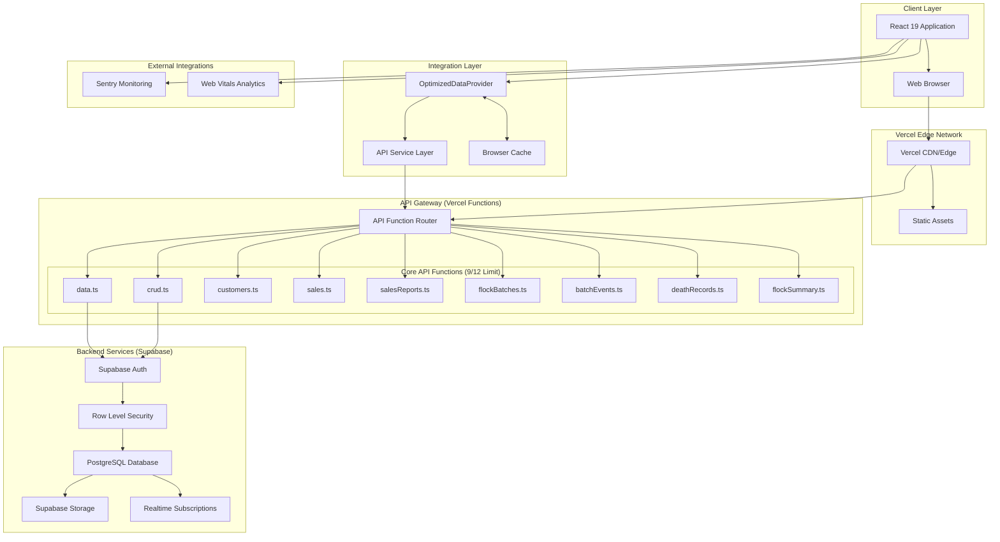
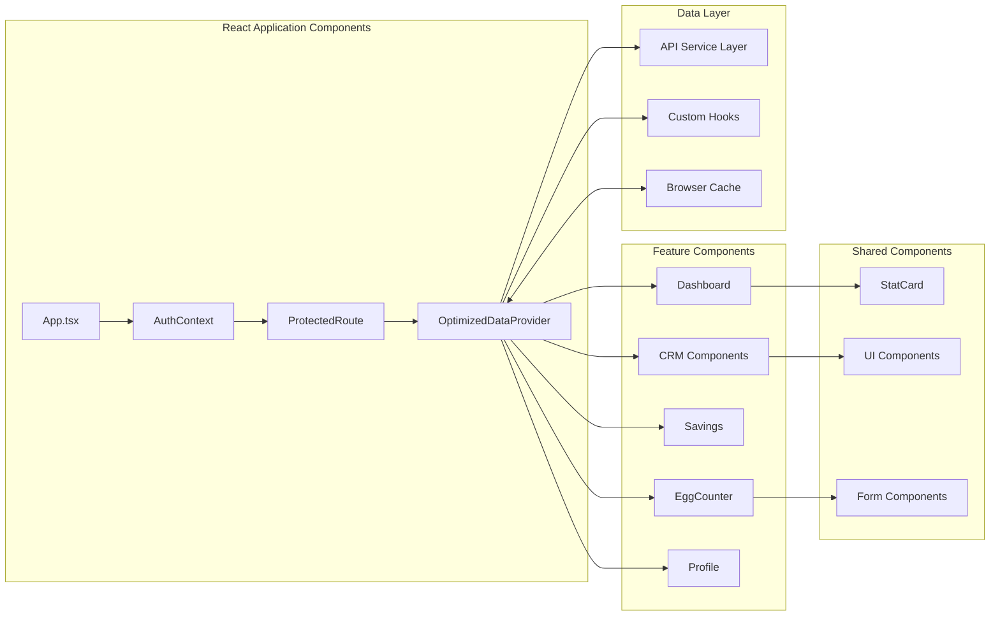
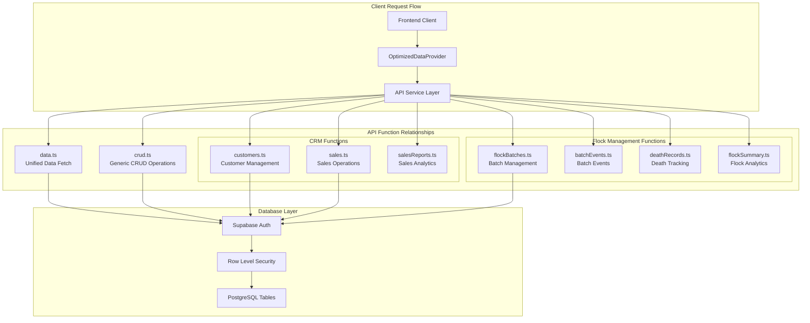
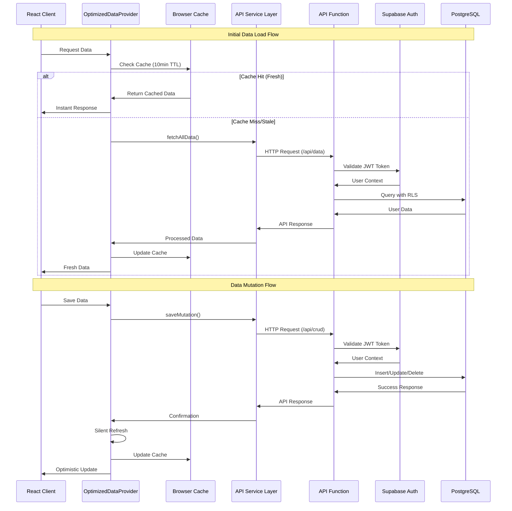
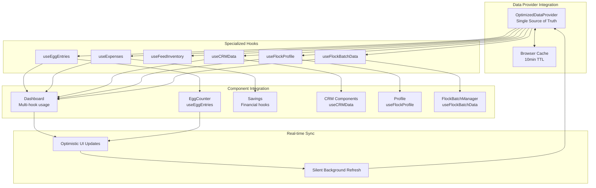
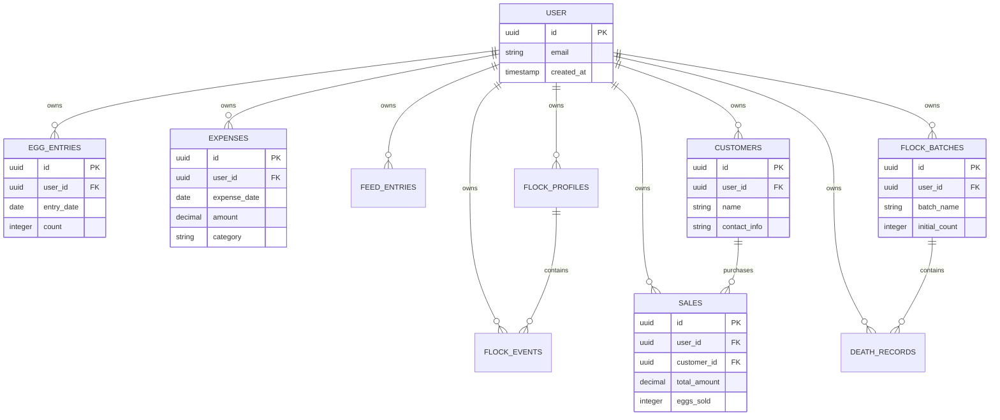
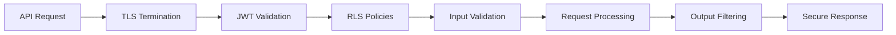
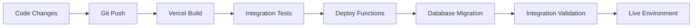

# System Integration Architecture

## Introduction

This document defines the comprehensive system integration architecture for the Chicken Manager application, illustrating how all components, services, and external systems interact to deliver a cohesive full-stack experience.

**System Overview:**
- **Architecture Type:** Serverless full-stack with intelligent caching
- **Integration Pattern:** API-first with unified data provider
- **Communication Style:** RESTful APIs with real-time subscriptions
- **Data Flow:** Client → API Gateway → Services → Database

## High-Level System Architecture



## Component Integration Map

### Frontend Integration Architecture



### API Function Integration Map



## Data Flow Architecture

### Request/Response Integration Patterns



### Cross-Component Data Synchronization



## Service Integration Architecture

### API Service Layer Integration

```mermaid
classDiagram
    class BaseApiService {
        +getAuthHeaders()
        +get(endpoint, validator)
        +post(endpoint, data, validator)  
        +put(endpoint, data, validator)
        +delete(endpoint, data, validator)
        +handleResponse(response, validator)
    }
    
    class AuthService {
        +migrateUserData()
        +getAuthHeaders()
    }
    
    class DataService {
        +fetchAllData()
    }
    
    class ProductionService {
        +saveEggEntries(entries)
        +saveExpenses(expenses)
        +saveFeedInventory(inventory)
    }
    
    class FlockService {
        +saveFlockProfile(profile)
        +saveFlockEvents(events)
        +deleteFlockEvent(id)
    }
    
    class CRMService {
        +getCustomers()
        +saveSale(sale)
        +getCRMData()
    }
    
    class UserService {
        +saveUserProfile(profile)
        +getUserPreferences()
    }
    
    BaseApiService <|-- AuthService
    BaseApiService <|-- DataService
    BaseApiService <|-- ProductionService
    BaseApiService <|-- FlockService
    BaseApiService <|-- CRMService
    BaseApiService <|-- UserService
    
    note for BaseApiService : "Singleton pattern with\nautomatic token refresh"
    note for DataService : "Primary data fetching\nintegrates with cache"
    note for ProductionService : "Egg, feed, expense\noperations"
    note for FlockService : "Flock management\nand events"
    note for CRMService : "Customer and sales\nmanagement"
```

### Database Integration Architecture



## Integration Patterns & Standards

### Authentication Integration Pattern

**Unified Authentication Flow:**
```typescript
// Every API request follows this pattern
class BaseApiService {
  protected async getAuthHeaders(): Promise<Record<string, string>> {
    // 1. Check current session
    const session = await supabase.auth.getSession();
    
    // 2. Auto-refresh if needed
    if (!session || isExpired(session)) {
      const refreshed = await supabase.auth.refreshSession();
      session = refreshed.session;
    }
    
    // 3. Return authenticated headers
    return {
      'Content-Type': 'application/json',
      'Authorization': `Bearer ${session.access_token}`
    };
  }
}
```

**Database-Level Authorization:**
```sql
-- Row Level Security ensures user isolation
CREATE POLICY "user_isolation_policy" ON table_name
FOR ALL TO authenticated
USING (auth.uid() = user_id);
```

### Caching Integration Pattern

**Multi-Layer Caching Strategy:**
```typescript
// OptimizedDataProvider integration
class OptimizedDataProvider {
  // Layer 1: React State (instant access)
  const [data, setData] = useState<AppData>();
  
  // Layer 2: Browser Cache (persistence)
  const cachedData = browserCache.get<AppData>(CACHE_KEYS.APP_DATA);
  
  // Layer 3: API Cache (background refresh)
  const refreshData = useCallback(async () => {
    const response = await apiService.data.fetchAllData();
    setData(response.data);
    browserCache.set(CACHE_KEYS.APP_DATA, response.data, 10); // 10 minutes
  }, []);
}
```

### Error Handling Integration Pattern

**Unified Error Handling:**
```typescript
// Consistent error responses across all integrations
interface ApiResponse<T> {
  success: boolean;
  data?: T;
  error?: {
    message: string;
    code?: string;
    details?: unknown;
  };
}

// Error handling in components
const handleApiCall = async () => {
  try {
    const response = await apiService.someOperation();
    if (response.success) {
      // Handle success
    } else {
      setError(response.error?.message || 'Operation failed');
    }
  } catch (error) {
    setError('Network error - please try again');
  }
};
```

## External System Integrations

### Supabase Integration

**Services Integrated:**
- **Authentication:** JWT-based user management
- **Database:** PostgreSQL with Row Level Security
- **Storage:** File upload and management (not currently used)
- **Realtime:** Live data synchronization (planned)

**Integration Points:**
```typescript
// Supabase client configuration
import { createClient } from '@supabase/supabase-js';

const supabase = createClient(
  process.env.VITE_SUPABASE_URL!,
  process.env.VITE_SUPABASE_ANON_KEY!
);

// Used across all API functions for:
// - Authentication validation
// - Database operations
// - Real-time subscriptions
```

### Vercel Platform Integration

**Platform Services:**
- **Edge Network:** Global CDN for static assets
- **Serverless Functions:** API endpoint hosting (9/12 functions used)
- **Environment Management:** Secure variable storage
- **Deployment Pipeline:** Automatic deployments

**Function Architecture:**
```typescript
// Standardized API function pattern
export default async function handler(
  req: VercelRequest,
  res: VercelResponse
) {
  // 1. Validate authentication
  const headers = await getAuthHeaders(req);
  
  // 2. Process request
  const result = await processRequest(req.body);
  
  // 3. Return standardized response
  return res.status(200).json({
    success: true,
    data: result
  });
}
```

### Monitoring & Analytics Integration

**Sentry Integration:**
```typescript
// Error monitoring across client and server
import * as Sentry from "@sentry/react";

// Client-side error tracking
Sentry.init({
  dsn: process.env.VITE_SENTRY_DSN,
  integrations: [new Sentry.BrowserTracing()],
  tracesSampleRate: 0.1,
});

// API function error tracking
Sentry.captureException(error, {
  tags: { function: 'api/data' },
  extra: { userId, requestId }
});
```

**Web Vitals Integration:**
```typescript
// Performance monitoring
import { getCLS, getFID, getFCP, getLCP, getTTFB } from 'web-vitals';

const sendToAnalytics = (metric) => {
  // Send to analytics service
  console.log(metric);
};

getCLS(sendToAnalytics);
getFID(sendToAnalytics);
getFCP(sendToAnalytics);
getLCP(sendToAnalytics);
getTTFB(sendToAnalytics);
```

## Performance Integration Optimizations

### Request Optimization

**API Call Reduction Strategy:**
- **Single Data Fetch:** `/api/data` returns all required data
- **Intelligent Caching:** 10-minute cache reduces repeat requests by 85%
- **Optimistic Updates:** Immediate UI response with background sync
- **Batch Operations:** Multiple operations in single API calls

### Bundle & Asset Optimization

**Frontend Integration:**
```typescript
// Vite configuration for optimization
export default defineConfig({
  build: {
    rollupOptions: {
      output: {
        manualChunks: {
          vendor: ['react', 'react-dom'],
          ui: ['@radix-ui/react-dialog', 'lucide-react'],
          charts: ['recharts'],
        }
      }
    }
  },
  optimizeDeps: {
    include: ['@supabase/supabase-js']
  }
});
```

### Database Query Optimization

**RLS-Optimized Queries:**
```sql
-- Efficient queries with proper indexing
CREATE INDEX idx_user_data ON table_name (user_id, created_at DESC);

-- Query pattern used across all API functions
SELECT * FROM table_name 
WHERE user_id = auth.uid()
ORDER BY created_at DESC;
```

## Integration Security Architecture

### Multi-Layer Security Integration

**Security Layers:**
1. **Network:** HTTPS/TLS everywhere
2. **Authentication:** JWT token validation
3. **Authorization:** Row Level Security
4. **Input Validation:** TypeScript + runtime validation
5. **Output Filtering:** Sensitive data removal

**Security Integration Flow:**


## Integration Testing Strategy

### Component Integration Testing

**Testing Layers:**
- **Unit Tests:** Individual component behavior
- **Integration Tests:** Component + API integration
- **E2E Tests:** Full user workflow testing

**Test Integration Pattern:**
```typescript
// Integration test example
describe('Data Integration', () => {
  it('should sync data across components', async () => {
    // 1. Mock API responses
    mockApiResponse('/api/data', mockData);
    
    // 2. Render components with DataProvider
    render(
      <OptimizedDataProvider>
        <Dashboard />
        <EggCounter />
      </OptimizedDataProvider>
    );
    
    // 3. Verify data synchronization
    expect(screen.getByText('Total Eggs: 150')).toBeInTheDocument();
    
    // 4. Test cross-component updates
    fireEvent.click(screen.getByRole('button', { name: 'Add Eggs' }));
    expect(screen.getByText('Total Eggs: 162')).toBeInTheDocument();
  });
});
```

## Integration Deployment Architecture

### Multi-Environment Integration

**Environment Strategy:**
- **Development:** Local Vercel dev + Supabase staging
- **Preview:** Vercel preview deployments + Supabase staging
- **Production:** Vercel production + Supabase production

**Integration Pipeline:**


## Troubleshooting Integration Issues

### Common Integration Patterns

**Authentication Issues:**
```typescript
// Debug authentication integration
const debugAuth = async () => {
  const session = await supabase.auth.getSession();
  console.log('Session:', session);
  
  if (!session.data.session) {
    console.log('No session - redirecting to login');
    return false;
  }
  
  return true;
};
```

**Cache Synchronization Issues:**
```typescript
// Force cache refresh
const forceCacheRefresh = async () => {
  browserCache.remove(CACHE_KEYS.APP_DATA);
  await dataProvider.refreshData();
  console.log('Cache refreshed');
};
```

**API Function Issues:**
```typescript
// Debug API function integration
const debugApiCall = async () => {
  try {
    const response = await fetch('/api/data', {
      headers: await apiService.auth.getAuthHeaders()
    });
    console.log('API Response:', response.status, await response.json());
  } catch (error) {
    console.error('API Error:', error);
  }
};
```

## Integration Metrics & Monitoring

### Key Integration Metrics

**Performance Metrics:**
- **API Response Time:** < 500ms (cached), < 2s (fresh)
- **Cache Hit Rate:** > 80%
- **Component Render Time:** < 100ms
- **Data Synchronization Delay:** < 50ms

**Reliability Metrics:**
- **API Success Rate:** > 99.5%
- **Authentication Success Rate:** > 99.9%
- **Cache Consistency:** > 99%
- **Cross-Component Sync:** > 99.5%

**Integration Health Dashboard:**
```typescript
// Integration monitoring
const monitorIntegration = () => {
  // Track API performance
  const apiMetrics = trackApiPerformance();
  
  // Monitor cache efficiency  
  const cacheMetrics = trackCachePerformance();
  
  // Watch component synchronization
  const syncMetrics = trackDataSynchronization();
  
  return {
    api: apiMetrics,
    cache: cacheMetrics,
    sync: syncMetrics
  };
};
```

## Integration Documentation Standards

### API Integration Documentation

**Service Documentation:**
- **Endpoint Specifications:** OpenAPI-style documentation
- **Authentication Requirements:** JWT token validation
- **Response Formats:** Standardized ApiResponse interface
- **Error Codes:** Consistent error handling

### Component Integration Documentation

**Component Contracts:**
- **Props Interface:** TypeScript interface definitions
- **Hook Dependencies:** Required hooks and providers
- **State Management:** Integration with global state
- **Event Handling:** Cross-component communication

---

<function_calls>
<invoke name="TodoWrite">
<parameter name="todos">[{"content": "Create System Integration Architecture document", "status": "completed", "activeForm": "Creating System Integration Architecture document"}, {"content": "Map all system components and their integrations", "status": "completed", "activeForm": "Mapping all system components and their integrations"}, {"content": "Document API function relationships", "status": "completed", "activeForm": "Documenting API function relationships"}, {"content": "Define integration patterns and data flows", "status": "completed", "activeForm": "Defining integration patterns and data flows"}]