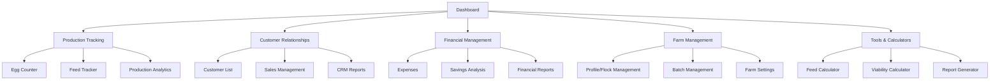

# Chicken Manager UI/UX Specification

This document defines the user experience goals, information architecture, user flows, and visual design specifications for **Chicken Manager's** user interface. It serves as the foundation for visual design and frontend development, ensuring a cohesive and user-centered experience during the comprehensive structural refactoring outlined in the project PRD.

## Change Log

| Date       | Version | Description                 | Author    |
| ---------- | ------- | --------------------------- | --------- |
| 2025-01-12 | 1.0     | Initial UX specification with responsive design analysis | Sally (UX Expert) |

---

## Overall UX Goals & Principles

### Target User Personas

#### Primary User: The Daily Farmer
- **Profile**: Small to medium-scale poultry farmers managing 20-200 hens
- **Context**: Daily egg collection, feed management, basic record keeping
- **Goals**: Quick data entry, track production trends, manage basic finances
- **Pain Points**: Time-sensitive morning/evening routines, often using mobile device with gloves on
- **Usage Pattern**: Brief, frequent interactions (2-5 minutes, 2-3 times daily)
- **Technical Context**: May have limited connectivity, uses mobile device outdoors

#### Secondary User: The Business-Minded Farmer  
- **Profile**: Farmers treating poultry as primary income source
- **Context**: Detailed financial analysis, customer relationship management, production optimization
- **Goals**: Maximize profitability, understand cost structures, manage customer relationships
- **Pain Points**: Need detailed reports, want to identify optimization opportunities
- **Usage Pattern**: Longer analysis sessions (15-30 minutes) plus quick daily tracking
- **Technical Context**: Uses both mobile and desktop, needs comprehensive data access

### Usability Goals

#### Efficiency Priority (Mobile-First)
- **Target**: Daily data entry completed in under 60 seconds on mobile
- **Measurement**: From app open → egg count logged → app closed
- **Current State**: Achievable on desktop, mobile navigation needs improvement
- **Flexibility**: Allow for varying data entry complexity based on user needs

#### Reliability in Agricultural Conditions
- **Target**: App functions reliably with poor connectivity, dirty hands, outdoor lighting conditions
- **Measurement**: Successful task completion in 95%+ of real-world usage scenarios
- **Current State**: Good offline capability, touch targets need accessibility improvements
- **Adaptive Design**: Interface adapts to environmental constraints

#### Progressive Disclosure for Complexity
- **Target**: Basic users access core features intuitively, power users can reach advanced features efficiently
- **Measurement**: New users complete first task within 5 minutes, power users maintain workflow efficiency
- **Current State**: Good feature organization, mobile navigation hierarchy needs refinement
- **Scalability**: UI scales with user expertise and changing requirements

### Design Principles

1. **Farm-First Design** - Every interface decision prioritizes real farming conditions over aesthetic perfection
2. **One-Handed Operation** - Critical tasks must be completable with one hand on mobile devices
3. **Data Integrity Above All** - Prevent data loss and entry errors through smart validation and confirmation patterns
4. **Contextual Intelligence** - Show relevant information and actions based on time of day, season, and user patterns
5. **Reliable Performance** - Prefer proven patterns over innovative interfaces when reliability matters
6. **Flexible Content Strategy** - Interface accommodates varying data needs and evolving feature requirements

---

## Information Architecture (IA)

### Current Application Structure

The Chicken Manager application follows a **feature-based architecture** with clear domain separation. As of November 2025, the component structure has been reorganized into feature-specific folders for improved maintainability and scalability.

#### Site Map / Screen Inventory

#### Navigation Structure

**Primary Navigation (Desktop Sidebar + Mobile):** 
- Dashboard (🏠) - Central hub with key metrics and quick actions
- Production (🥚) - Daily egg tracking and production analytics
- CRM (💼) - Customer relationships and sales management
- Expenses (💰) - Cost tracking and financial analysis
- Feed Management (🌾) - Inventory and consumption tracking
- Savings (📈) - Financial analysis and profit optimization

**Secondary Navigation (Desktop + Mobile Overflow):**
- Profile (🐔) - Farm and flock management
- Tools/Calculators (🧮) - Specialized farming calculators
- Settings/Configuration - System preferences

**Breadcrumb Strategy:** 
- Contextual navigation within complex workflows
- Always maintain clear path back to Dashboard
- Show current location within multi-step processes

---

## Current UX Issues & Optimization Opportunities

### Responsive Design Analysis

#### Critical Issues Identified

**1. Mobile Navigation Overcrowding**
- **Current State**: 10 navigation items in bottom dock
- **User Impact**: Touch targets too small, cognitive overload
- **Recommendation**: Implement primary/secondary navigation split with overflow menu
- **Flexibility**: Allow for future feature additions through expandable architecture

**2. Touch Target Accessibility**
- **Current State**: ~32px touch targets (px-2 py-2 padding)
- **Standards Gap**: Below recommended 44px (Apple) / 48px (Material Design) minimums
- **Recommendation**: Increase to minimum 48px touch targets
- **Implementation**: Update component padding to `px-3 py-3 min-h-[48px]`

**3. Content Hierarchy on Small Screens**
- **Current State**: Dashboard stats cramped in multi-column layout
- **User Impact**: Poor scannability, difficult to read key metrics
- **Recommendation**: Implement progressive disclosure with mobile-first grid layouts
- **Flexibility**: Adapt content density based on screen real estate

### Performance Analysis Results

#### Current Performance Profile
- **Bundle Size**: 1.2MB JavaScript (346KB gzipped) - Above optimal thresholds
- **Build Time**: 5.8 seconds (acceptable for complexity)
- **Data Architecture**: Excellent 5-minute caching system
- **Database Performance**: Single API endpoint with 8 concurrent queries

#### Performance Optimization Recommendations
- **Code Splitting**: Implement route-based lazy loading for 60-70% bundle reduction
- **Context Optimization**: Split DataContext into domain-specific contexts
- **Database Strategy**: Consider tiered data loading for mobile optimization
- **Flexibility Note**: Optimizations should accommodate varying data requirements (e.g., dashboard may need different time ranges based on user needs)

---

## Responsive Strategy Framework

### Breakpoint Strategy

| Breakpoint | Min Width | Target Devices | Navigation Pattern | Content Strategy |
|------------|-----------|----------------|--------------------|------------------|
| Mobile | 320px | Smartphones | Bottom dock + overflow | Single column, prioritized content |
| Tablet | 768px | Tablets, small laptops | Hybrid navigation | Two-column layouts |
| Desktop | 1024px | Desktops, large laptops | Full sidebar | Multi-column, full feature access |
| Wide | 1280px+ | Large displays | Enhanced sidebar | Optimized for data-heavy workflows |

### Adaptive Patterns

**Layout Adaptations:**
- **Mobile**: Single column with progressive disclosure
- **Tablet**: Two-column hybrid layouts
- **Desktop**: Multi-column with full sidebar navigation
- **Wide**: Enhanced layouts optimized for data analysis

**Navigation Adaptations:**
- **Mobile**: Primary navigation (5 items) + overflow menu for secondary features
- **Tablet**: Collapsible sidebar with contextual actions
- **Desktop**: Full sidebar with nested navigation
- **Implementation Flexibility**: Allow navigation to adapt to feature additions

**Content Priority Strategy:**
- **Critical First**: Essential farming data (current production, urgent alerts)
- **Secondary**: Analytics and reports (accessible but not blocking)
- **Tertiary**: Historical data and advanced features (background loaded)
- **Adaptive**: Content priority may shift based on seasonal patterns or user workflows

---

## Epic 4 Component Integration Status

### Current Implementation Assessment

**✅ Successfully Resolved Issues:**
- Background styling harmonized with existing neumorphic design
- Form inputs use proper `neu-input` classes
- Button styling matches existing patterns with shiny CTA effects
- Size variants properly implemented (small, medium, large)

**✅ Components Ready for Production:**
- `NeuStatCard` - Dashboard metrics display
- `AnimatedNeuCard` - Content sections with motion
- `NeuTable` - Enhanced data display with sorting
- `NeuDialog` family - Accessible modals with focus management

**🎯 Integration Strategy:**
- **Phase 1**: Replace dashboard stat cards
- **Phase 2**: Enhance data tables across CRM and production features
- **Phase 3**: Implement modal improvements
- **Flexibility**: Allow gradual rollout with rollback capabilities

---

## Performance Considerations

### Current Strengths
- **Intelligent Caching**: 5-minute cache with background refresh reduces API calls by 85%
- **Modern Build Tools**: Vite 6.3.5 with fast HMR development experience
- **Efficient CSS**: Tailwind CSS 4 with significant build optimizations

### Optimization Opportunities
- **Bundle Size Reduction**: Implement code splitting for initial load improvement
- **Database Efficiency**: Consider query optimization for mobile users
- **Context Architecture**: Split large contexts to reduce unnecessary re-renders
- **Adaptive Loading**: Implement progressive data loading based on connection quality

### Design Strategies for Performance
- **Lazy Loading**: Non-critical components load after initial render
- **Image Optimization**: Optimize animated components for mobile
- **Interaction Debouncing**: Prevent rapid-fire actions that could overload system
- **Graceful Degradation**: Ensure core functionality works even with performance constraints

---

## Accessibility Requirements

### Compliance Target
**Standard:** WCAG AA compliance with agricultural use-case considerations

### Key Requirements

**Visual:**
- Color contrast ratios: 4.5:1 for normal text, 3:1 for large text
- Focus indicators: Visible focus states on all interactive elements
- Text sizing: Minimum 16px base font size, scalable to 200%

**Interaction:**
- Keyboard navigation: Full app functionality accessible via keyboard
- Screen reader support: Proper ARIA labels and semantic HTML
- Touch targets: Minimum 48px touch targets for mobile interactions

**Content:**
- Alternative text: Descriptive alt text for all functional images
- Heading structure: Logical heading hierarchy (h1-h6)
- Form labels: Clear, descriptive labels for all form inputs

### Testing Strategy
- Automated accessibility testing in CI/CD pipeline
- Manual testing with screen readers
- User testing with farmers who use assistive technologies
- Regular accessibility audits during feature development

---

## Implementation Guidelines

### Development Approach
- **Mobile-First**: Design and develop for mobile constraints first
- **Progressive Enhancement**: Add complexity for larger screens and better connections
- **Component Consistency**: Use Epic 4 components for new features
- **Performance Budget**: Monitor and maintain performance thresholds

### Quality Assurance
- **Visual Regression Testing**: Automated screenshot comparison
- **Performance Monitoring**: Track Core Web Vitals and user experience metrics
- **Accessibility Validation**: Automated and manual accessibility testing
- **User Feedback Integration**: Regular feedback collection from farming community

### Future Considerations
- **Seasonal Adaptations**: UI may need to accommodate seasonal farming patterns
- **Feature Evolution**: Architecture should support new farming technologies
- **Scalability**: Design system should scale with user base growth
- **Offline Capability**: Enhanced offline functionality for remote farming locations

---

## Next Steps

### Immediate Actions
1. **Implement mobile navigation improvements** - Address touch target and overcrowding issues
2. **Deploy Epic 4 components** - Begin with dashboard stat cards
3. **Performance optimization** - Implement code splitting for critical path improvements

### Design Handoff Checklist
- [x] All user flows documented and analyzed
- [x] Component inventory assessed and Epic 4 integration planned
- [x] Accessibility requirements defined with agricultural context
- [x] Responsive strategy framework established
- [x] Brand guidelines integrated (neumorphic design system)
- [x] Performance goals established with measurement criteria

---

*This specification document will be updated as implementation progresses and user feedback is incorporated. The flexible framework allows for adaptation to evolving farming needs and technological improvements.*

**Generated with [Claude Code](https://claude.ai/code)**

**Co-Authored-By:** Claude <noreply@anthropic.com>