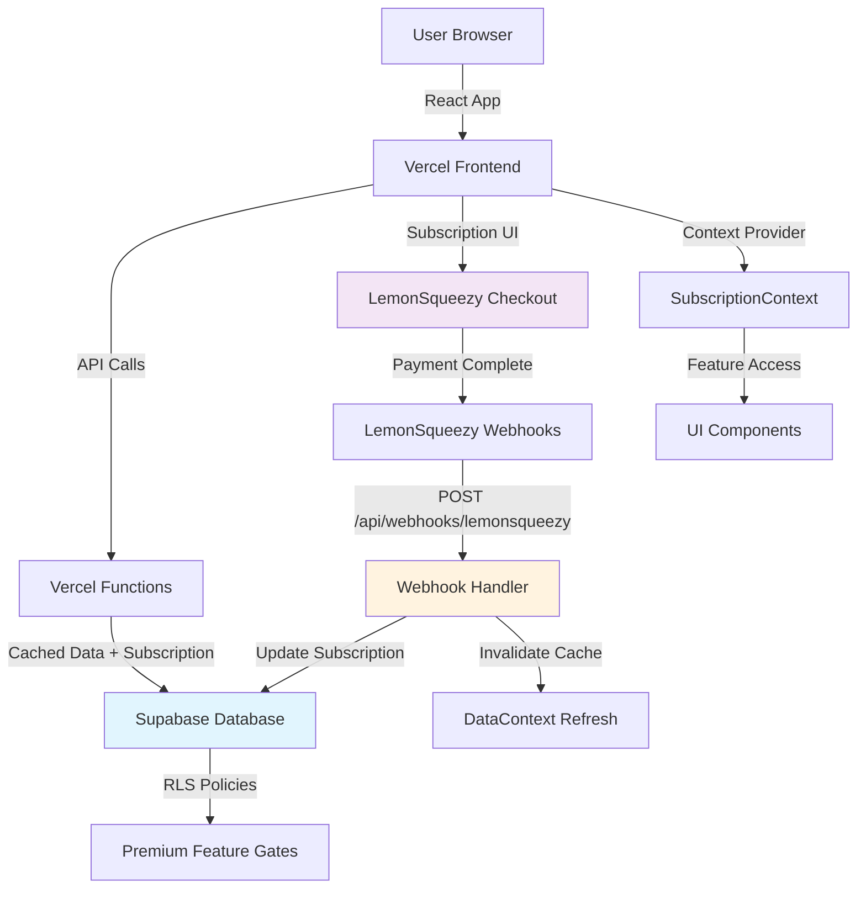
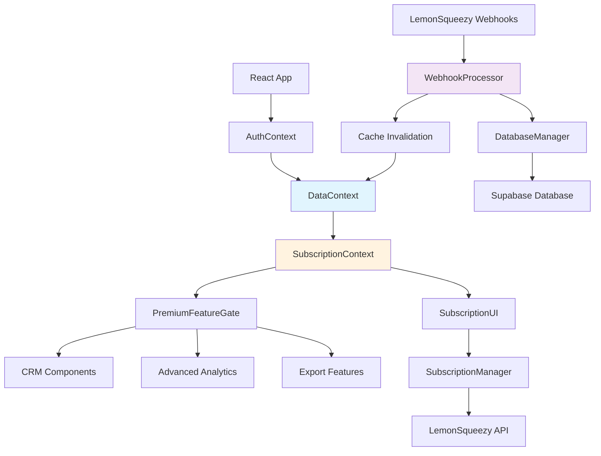
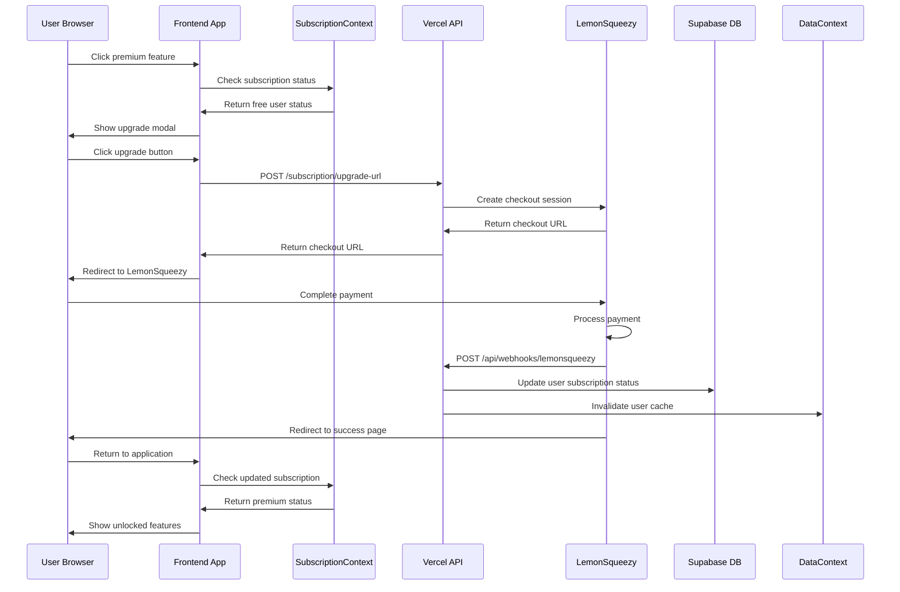
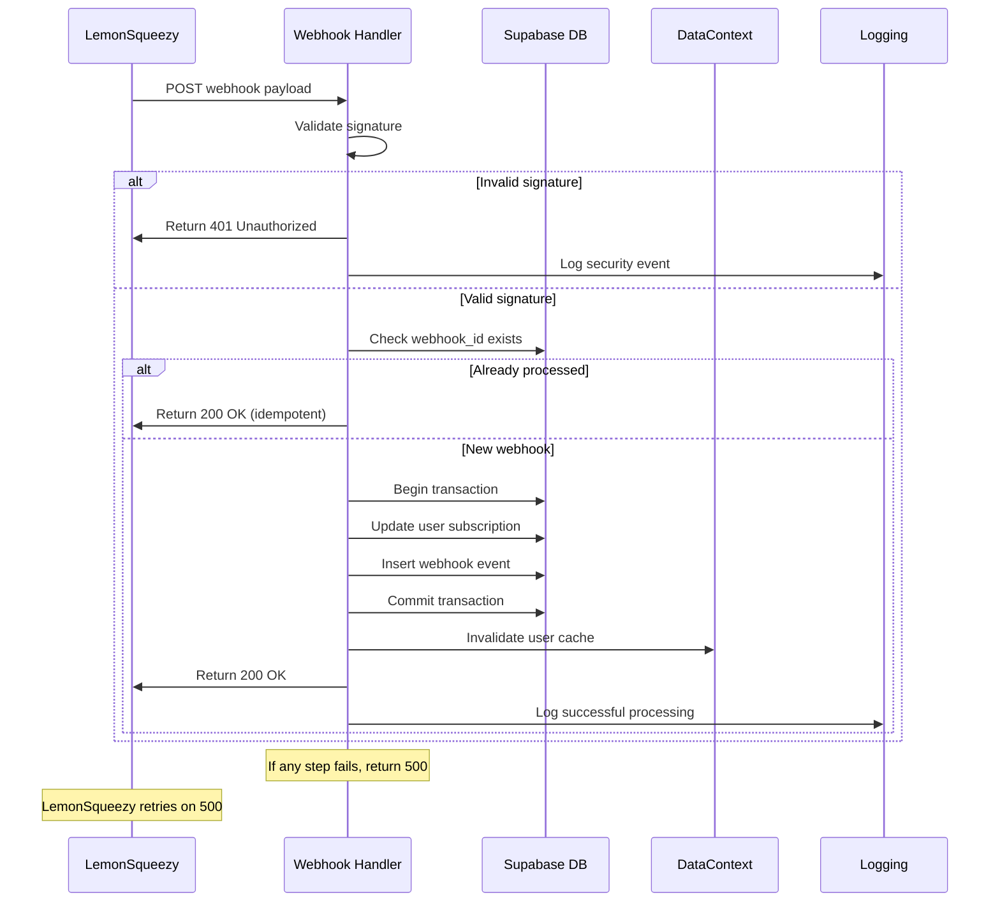
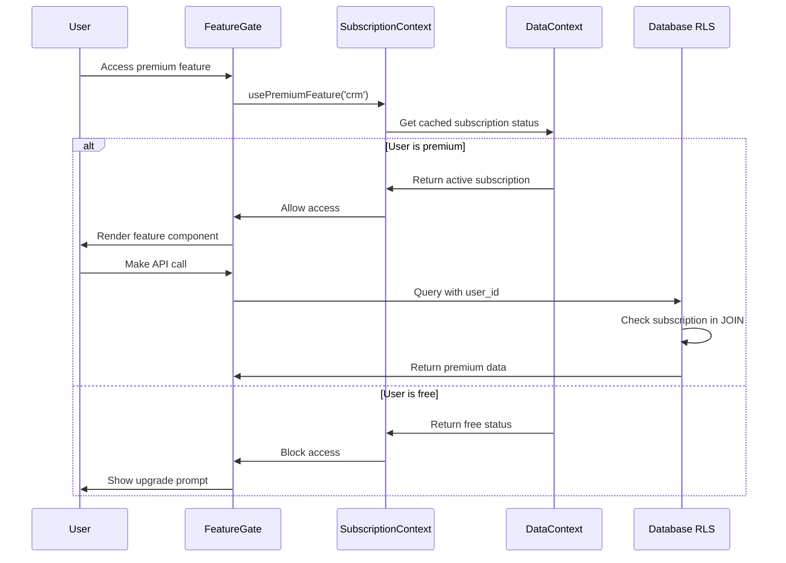
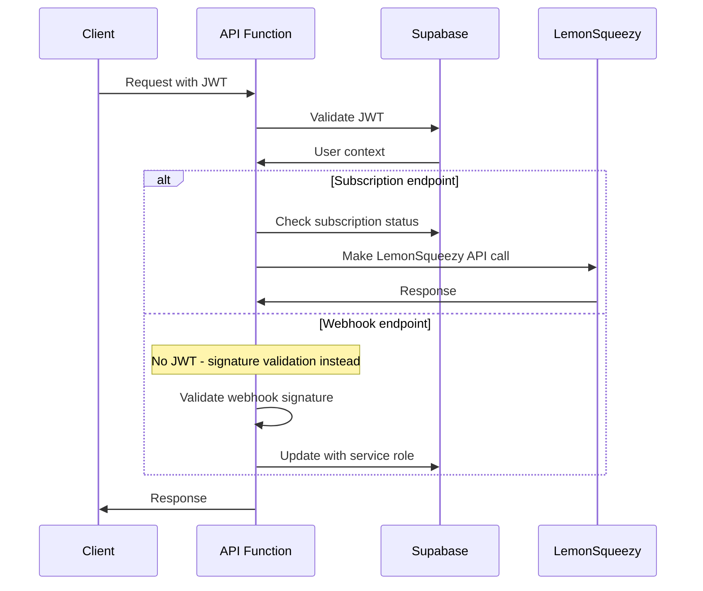
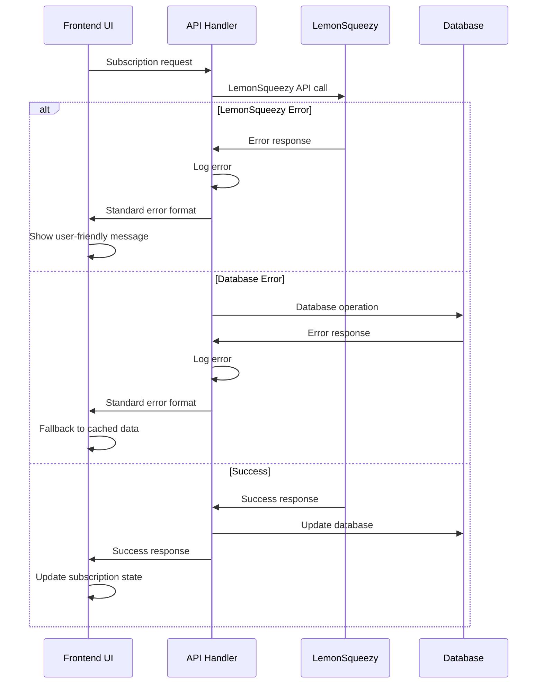

# LemonSqueezy Subscription System - Fullstack Architecture Document

This document outlines the complete fullstack architecture for **LemonSqueezy Subscription Integration**, including webhook processing systems, premium feature authorization, and subscription management within your existing React/Supabase/Vercel stack. It serves as the single source of truth for AI-driven development, ensuring consistency across the entire technology stack.

This unified approach integrates seamlessly with your current poultry management application architecture while adding robust subscription capabilities through LemonSqueezy payment processing.

## Introduction

### Starter Template or Existing Project

**Status:** **Existing Project Extension**

Your application is built on:
- **React 19 + TypeScript + Vite** frontend
- **Supabase (PostgreSQL)** with Row Level Security
- **Vercel** serverless deployment
- **Existing authentication system** via Supabase Auth
- **Tailwind CSS 4.x** design system
- **Sophisticated DataContext caching system** (5-minute cache, 85% API call reduction)

**Architectural Constraints:**
- Must preserve existing authentication flow and DataContext patterns
- Cannot disrupt current free users or their data
- Must integrate with existing `api/getData` unified API approach
- Must respect current RLS policies and user data isolation
- Should leverage existing monorepo structure and development workflow

**Critical Design Decisions Made:**
1. **Preserve existing patterns** - Subscription status becomes part of your DataContext system
2. **Extend RLS policies** - Add subscription checks to existing user_id-based security
3. **Leverage Vercel functions** - Webhook processing fits your serverless approach
4. **Build on existing auth** - Subscription tied to your current user system

### Change Log

| Date | Version | Description | Author |
|------|---------|-------------|--------|
| 2025-08-30 | 1.0 | Initial architecture document based on PRD requirements | Winston (Architect) |

## High Level Architecture

### Technical Summary

The LemonSqueezy subscription system extends your existing React/Supabase/Vercel architecture with serverless webhook processing, database-level feature gating via RLS policies, and React Context-based subscription state management. The system leverages your current DataContext caching patterns to ensure subscription checks have zero performance impact, while webhook processing provides real-time subscription synchronization through Vercel serverless functions. Premium feature authorization occurs at both the UI component level and database RLS level, creating defense-in-depth security that prevents unauthorized access regardless of client-side manipulation. This architecture maintains your existing authentication flows and user data isolation while adding transparent subscription management that scales with your current infrastructure patterns.

### Platform and Infrastructure Choice

**Platform:** Vercel + Supabase (Extended Current Stack)  
**Key Services:** Vercel Functions (webhooks), Supabase RLS (feature gating), LemonSqueezy (payments)  
**Deployment Host and Regions:** Vercel Edge (existing), Supabase US-East (existing)

### Repository Structure

**Structure:** Monorepo (Current)  
**Monorepo Tool:** NPM workspaces (existing)  
**Package Organization:** Extend existing structure with subscription modules in current api/ and src/ directories

### High Level Architecture Diagram



### Architectural Patterns

- **Serverless Webhook Processing:** Vercel functions handle LemonSqueezy webhooks - _Rationale:_ Fits your existing serverless architecture and scales automatically
- **Extended DataContext Pattern:** Subscription status integrated into existing cache - _Rationale:_ Maintains consistent performance patterns and development familiarity  
- **Database-Level Feature Gating:** RLS policies enforce subscription access - _Rationale:_ Provides backend security that can't be bypassed by client manipulation
- **React Context State Management:** Subscription state via existing context patterns - _Rationale:_ Leverages your proven state management approach
- **Progressive Enhancement:** Free users see previews, subscribers get full access - _Rationale:_ Maximizes conversion while maintaining user experience
- **Defense in Depth:** UI gates + API validation + RLS policies - _Rationale:_ Multiple layers prevent unauthorized premium feature access

## Tech Stack

### Technology Stack Table

| Category | Technology | Version | Purpose | Rationale |
|----------|------------|---------|---------|-----------|
| Frontend Language | TypeScript | 5.x | Type-safe subscription state management | Already established in your codebase |
| Frontend Framework | React | 19.x | Subscription UI components and context | Your current framework choice |
| UI Component Library | Tailwind CSS + Custom Components | 4.x | Subscription management interfaces | Maintains design system consistency |
| State Management | React Context (Extended DataContext) | React 19 | Subscription status caching | Integrates with your existing 85% cache hit system |
| Backend Language | TypeScript | 5.x | Webhook processing functions | Consistency across frontend/backend |
| Backend Framework | Vercel Functions | Latest | LemonSqueezy webhook handlers | Your existing serverless infrastructure |
| API Style | REST (Extended existing endpoints) | - | Subscription status endpoints | Maintains your current API patterns |
| Database | Supabase PostgreSQL | Latest | Extended users table + webhook logs | Your existing database with minimal schema changes |
| Cache | DataContext (5-minute cycle) | - | Subscription status caching | Proven performance pattern in your app |
| File Storage | Supabase Storage | Latest | Invoice/receipt storage (if needed) | Your existing storage solution |
| Authentication | Supabase Auth (Extended) | Latest | User-subscription linking | Your established auth system |
| Frontend Testing | Vitest + React Testing Library | Latest | Subscription component testing | Your current testing setup |
| Backend Testing | Vitest | Latest | Webhook handler testing | Consistency with frontend testing |
| E2E Testing | Playwright | Latest | Subscription flow testing | Modern E2E tool for payment flows |
| Build Tool | Vite | Latest | Frontend builds | Your existing build system |
| Bundler | Vite | Latest | Code bundling | Your existing bundler |
| IaC Tool | Vercel CLI | Latest | Deployment configuration | Your current deployment approach |
| CI/CD | GitHub Actions (Extended) | Latest | Subscription feature testing | Your existing CI/CD with added test scenarios |
| Monitoring | Vercel Analytics + Supabase Logs | Latest | Webhook processing monitoring | Leverages your existing monitoring |
| Logging | Console + Supabase Functions | Latest | Webhook event logging | Your existing logging infrastructure |
| CSS Framework | Tailwind CSS | 4.x | Subscription UI styling | Your current styling approach |
| Payment Processing | LemonSqueezy | Latest | Subscription management and billing | International compliance, VAT handling |
| Webhook Signatures | crypto (Node.js) | Built-in | Webhook security verification | Standard security for webhook validation |

## Data Models

### User (Extended)

**Purpose:** Extends your existing users table with subscription information to maintain single source of truth for user data

**Key Attributes:**
- user_id: UUID - Existing primary key (unchanged)
- email: String - Existing field (unchanged)  
- subscription_status: Enum - Current subscription state (free, active, cancelled, past_due)
- subscription_id: String - LemonSqueezy subscription identifier
- customer_id: String - LemonSqueezy customer identifier
- billing_email: String - Email used for billing (may differ from login email)
- subscription_start_date: Timestamp - When premium subscription began
- subscription_end_date: Timestamp - When subscription expires (for cancelled users)
- plan_id: String - LemonSqueezy product variant identifier
- updated_at: Timestamp - Last subscription sync timestamp

#### TypeScript Interface
```typescript
interface User {
  // Existing fields
  id: string;
  email: string;
  created_at: string;
  
  // New subscription fields
  subscription_status: 'free' | 'active' | 'cancelled' | 'past_due' | 'paused';
  subscription_id?: string;
  customer_id?: string;
  billing_email?: string;
  subscription_start_date?: string;
  subscription_end_date?: string;
  plan_id?: string;
  subscription_updated_at?: string;
}
```

#### Relationships
- Maintains existing relationships to flock_profiles, egg_entries, etc.
- No new foreign key relationships needed - subscription data is embedded

### WebhookEvent

**Purpose:** Audit trail and idempotency tracking for LemonSqueezy webhook processing

**Key Attributes:**
- id: UUID - Primary key
- webhook_id: String - LemonSqueezy webhook unique identifier (for idempotency)
- event_type: String - Type of webhook event (subscription_created, subscription_updated, etc.)
- user_id: UUID - Foreign key to users table
- processed_at: Timestamp - When webhook was successfully processed
- payload: JSONB - Raw webhook payload for debugging
- processing_status: Enum - Success, failed, or retrying

#### TypeScript Interface
```typescript
interface WebhookEvent {
  id: string;
  webhook_id: string;
  event_type: string;
  user_id: string;
  processed_at: string;
  payload: Record<string, any>;
  processing_status: 'success' | 'failed' | 'retrying';
}
```

#### Relationships
- Belongs to User (user_id foreign key)

### SubscriptionFeature

**Purpose:** Configuration table defining which features require premium subscription

**Key Attributes:**
- feature_key: String - Unique identifier for feature (primary key)
- feature_name: String - Human readable feature name
- description: String - Feature description for UI
- requires_premium: Boolean - Whether feature requires subscription
- created_at: Timestamp - When feature gate was added

#### TypeScript Interface
```typescript
interface SubscriptionFeature {
  feature_key: string;
  feature_name: string;
  description: string;
  requires_premium: boolean;
  created_at: string;
}
```

#### Relationships
- Referenced by application code for feature gating (no foreign keys)

### Shared Types for Frontend/Backend

#### Subscription Context Data
```typescript
interface SubscriptionContextData {
  user: User;
  isPremium: boolean;
  isLoading: boolean;
  features: Record<string, boolean>;
  upgradeUrl?: string;
  customerPortalUrl?: string;
}
```

#### Premium Feature Check
```typescript
interface FeatureAccess {
  hasAccess: boolean;
  requiresUpgrade: boolean;
  featureName: string;
  upgradePrompt?: string;
}
```

## API Specification

### REST API Specification

```yaml
openapi: 3.0.0
info:
  title: Poultry Management API - Subscription Extension
  version: 1.0.0
  description: LemonSqueezy subscription integration endpoints extending existing poultry management API
servers:
  - url: https://your-app.vercel.app/api
    description: Production API
  - url: http://localhost:3000/api
    description: Development API

paths:
  /webhooks/lemonsqueezy:
    post:
      summary: LemonSqueezy webhook endpoint
      description: Processes subscription lifecycle events from LemonSqueezy
      security: []  # No auth required - webhook signature validation instead
      requestBody:
        required: true
        content:
          application/json:
            schema:
              type: object
              properties:
                meta:
                  type: object
                  properties:
                    event_name:
                      type: string
                      enum: [subscription_created, subscription_updated, subscription_cancelled, subscription_resumed, subscription_payment_success, subscription_payment_failed]
                    webhook_id:
                      type: string
                data:
                  type: object
                  properties:
                    id:
                      type: string
                    type:
                      type: string
                    attributes:
                      type: object
                      properties:
                        store_id:
                          type: number
                        customer_id:
                          type: number
                        order_id:
                          type: number
                        user_email:
                          type: string
                        status:
                          type: string
                        ends_at:
                          type: string
                        trial_ends_at:
                          type: string
                        billing_anchor:
                          type: number
      responses:
        200:
          description: Webhook processed successfully
          content:
            application/json:
              schema:
                type: object
                properties:
                  success:
                    type: boolean
                  processed_at:
                    type: string
        400:
          description: Invalid webhook payload
        401:
          description: Invalid webhook signature
        500:
          description: Webhook processing failed

  /subscription/status:
    get:
      summary: Get current user's subscription status
      description: Returns subscription details for authenticated user
      security:
        - bearerAuth: []
      responses:
        200:
          description: Subscription status retrieved
          content:
            application/json:
              schema:
                $ref: '#/components/schemas/SubscriptionStatus'
        401:
          description: Not authenticated

  /subscription/upgrade-url:
    post:
      summary: Generate LemonSqueezy checkout URL
      description: Creates personalized upgrade URL for current user
      security:
        - bearerAuth: []
      requestBody:
        required: true
        content:
          application/json:
            schema:
              type: object
              properties:
                plan_id:
                  type: string
                  description: LemonSqueezy product variant ID
                success_url:
                  type: string
                  description: Return URL after successful payment
      responses:
        200:
          description: Checkout URL generated
          content:
            application/json:
              schema:
                type: object
                properties:
                  checkout_url:
                    type: string
                  expires_at:
                    type: string

  /subscription/customer-portal:
    get:
      summary: Get LemonSqueezy customer portal URL
      description: Returns URL for subscription management portal
      security:
        - bearerAuth: []
      responses:
        200:
          description: Customer portal URL retrieved
          content:
            application/json:
              schema:
                type: object
                properties:
                  portal_url:
                    type: string
        404:
          description: No active subscription found

  /subscription/features:
    get:
      summary: Get feature access for current user
      description: Returns which features are available based on subscription
      security:
        - bearerAuth: []
      responses:
        200:
          description: Feature access retrieved
          content:
            application/json:
              schema:
                type: object
                properties:
                  features:
                    type: object
                    additionalProperties:
                      $ref: '#/components/schemas/FeatureAccess'

  # Extended existing endpoint
  /getData:
    get:
      summary: Get all user data (Extended with subscription)
      description: Your existing unified data endpoint now includes subscription status
      security:
        - bearerAuth: []
      responses:
        200:
          description: User data with subscription information
          content:
            application/json:
              schema:
                allOf:
                  - $ref: '#/components/schemas/ExistingUserData'
                  - type: object
                    properties:
                      subscription:
                        $ref: '#/components/schemas/SubscriptionStatus'

components:
  securitySchemes:
    bearerAuth:
      type: http
      scheme: bearer
      bearerFormat: JWT

  schemas:
    SubscriptionStatus:
      type: object
      properties:
        status:
          type: string
          enum: [free, active, cancelled, past_due, paused]
        is_premium:
          type: boolean
        subscription_id:
          type: string
          nullable: true
        plan_id:
          type: string
          nullable: true
        billing_email:
          type: string
          nullable: true
        subscription_start_date:
          type: string
          nullable: true
        subscription_end_date:
          type: string
          nullable: true
        next_billing_date:
          type: string
          nullable: true

    FeatureAccess:
      type: object
      properties:
        has_access:
          type: boolean
        requires_upgrade:
          type: boolean
        feature_name:
          type: string
        upgrade_prompt:
          type: string
          nullable: true

    ExistingUserData:
      type: object
      description: Your existing getData response structure (unchanged)
      properties:
        user:
          type: object
        flockProfiles:
          type: array
        eggEntries:
          type: array
        expenses:
          type: array
        # ... other existing data structures

    Error:
      type: object
      properties:
        error:
          type: object
          properties:
            code:
              type: string
            message:
              type: string
            details:
              type: object
            timestamp:
              type: string
            requestId:
              type: string
```

## Components

### WebhookProcessor

**Responsibility:** Processes LemonSqueezy webhook events and synchronizes subscription status with your database

**Key Interfaces:**
- `POST /api/webhooks/lemonsqueezy` - Receives webhook payloads
- Database update interface for user subscription fields
- Cache invalidation trigger for DataContext refresh

**Dependencies:** Supabase client, crypto module (signature validation), DataContext invalidation mechanism

**Technology Stack:** Vercel Function (TypeScript), Node.js crypto for webhook signature validation, Supabase SDK for database updates

### SubscriptionContext

**Responsibility:** Provides subscription state and feature access checking throughout your React application

**Key Interfaces:**
- `useSubscription()` hook - Returns current subscription status
- `usePremiumFeature(featureKey)` hook - Returns feature access state
- Context provider wrapping your existing DataContext consumption

**Dependencies:** DataContext (for cached subscription data), React Context API

**Technology Stack:** React Context, TypeScript, integrates with your existing context hierarchy

### PremiumFeatureGate

**Responsibility:** UI component that conditionally renders premium features with upgrade prompts for free users

**Key Interfaces:**
- `<PremiumFeatureGate feature="crm">` - Wraps premium components
- `onUpgradeClick` callback - Triggers LemonSqueezy checkout
- Preview mode rendering for locked features

**Dependencies:** SubscriptionContext, LemonSqueezy checkout URL generation, your existing UI components

**Technology Stack:** React component, Tailwind CSS (your existing styling), follows your component patterns

### SubscriptionManager

**Responsibility:** Handles subscription lifecycle operations like upgrades, downgrades, and cancellations

**Key Interfaces:**
- `generateCheckoutUrl(planId)` - Creates LemonSqueezy checkout links
- `getCustomerPortalUrl()` - Returns billing management URL
- `syncSubscriptionStatus()` - Manual refresh trigger

**Dependencies:** LemonSqueezy API, Supabase database, DataContext invalidation

**Technology Stack:** Vercel API functions, LemonSqueezy SDK, integrates with your existing API service layer

### DatabaseManager (Extended)

**Responsibility:** Your existing database access layer extended with subscription-aware RLS policies

**Key Interfaces:**
- Extended RLS policies on existing tables (flock_profiles, egg_entries, etc.)
- New webhook_events table management
- User subscription field updates

**Dependencies:** Supabase client, your existing database models

**Technology Stack:** Supabase PostgreSQL, RLS policies, extends your current database architecture

### SubscriptionUI

**Responsibility:** User interface components for subscription management, billing, and feature comparison

**Key Interfaces:**
- Subscription status dashboard in settings
- Feature comparison table for upgrades
- Billing history and payment method management

**Dependencies:** SubscriptionContext, SubscriptionManager, LemonSqueezy customer portal, your existing UI components

**Technology Stack:** React components, Tailwind CSS, follows your existing component library patterns

### Component Diagrams



## External APIs

### LemonSqueezy API

- **Purpose:** Complete subscription lifecycle management including checkout, billing, customer portal, and webhook events
- **Documentation:** https://docs.lemonsqueezy.com/api
- **Base URL(s):** 
  - Production: `https://api.lemonsqueezy.com/v1/`
  - Sandbox: `https://api.lemonsqueezy.com/v1/` (with test API key)
- **Authentication:** Bearer token using LemonSqueezy API key
- **Rate Limits:** 1000 requests per minute per API key

**Key Endpoints Used:**
- `GET /checkouts` - Create hosted checkout sessions for subscription upgrades
- `GET /subscriptions/{id}` - Retrieve subscription details for status verification
- `GET /customers/{id}` - Get customer information and billing details
- `PATCH /subscriptions/{id}` - Update subscription details (pause/resume)
- `GET /subscription-invoices` - Access billing history and invoices

**Integration Notes:** 
- Webhooks provide real-time subscription updates, reducing need for polling
- Customer portal URLs generated server-side for security
- Sandbox environment essential for testing payment flows
- International tax compliance handled automatically by LemonSqueezy
- Subscription status synchronization occurs through webhooks rather than polling API

## Core Workflows

### Subscription Upgrade Flow



### Webhook Processing Flow



### Feature Access Validation Flow



## Database Schema

```sql
-- Extend existing users table with subscription fields
ALTER TABLE public.users 
ADD COLUMN subscription_status VARCHAR(20) DEFAULT 'free' CHECK (subscription_status IN ('free', 'active', 'cancelled', 'past_due', 'paused')),
ADD COLUMN subscription_id VARCHAR(255),
ADD COLUMN customer_id VARCHAR(255), 
ADD COLUMN billing_email VARCHAR(255),
ADD COLUMN subscription_start_date TIMESTAMPTZ,
ADD COLUMN subscription_end_date TIMESTAMPTZ,
ADD COLUMN plan_id VARCHAR(255),
ADD COLUMN subscription_updated_at TIMESTAMPTZ DEFAULT NOW();

-- Create index for subscription status queries
CREATE INDEX idx_users_subscription_status ON public.users(subscription_status);
CREATE INDEX idx_users_subscription_id ON public.users(subscription_id) WHERE subscription_id IS NOT NULL;

-- Webhook event logging table
CREATE TABLE public.webhook_events (
    id UUID PRIMARY KEY DEFAULT gen_random_uuid(),
    webhook_id VARCHAR(255) UNIQUE NOT NULL,
    event_type VARCHAR(100) NOT NULL,
    user_id UUID REFERENCES public.users(id) ON DELETE CASCADE,
    processed_at TIMESTAMPTZ DEFAULT NOW(),
    payload JSONB NOT NULL,
    processing_status VARCHAR(20) DEFAULT 'success' CHECK (processing_status IN ('success', 'failed', 'retrying')),
    created_at TIMESTAMPTZ DEFAULT NOW()
);

-- Indexes for webhook event queries
CREATE INDEX idx_webhook_events_webhook_id ON public.webhook_events(webhook_id);
CREATE INDEX idx_webhook_events_user_id ON public.webhook_events(user_id);
CREATE INDEX idx_webhook_events_created_at ON public.webhook_events(created_at);

-- Feature configuration table
CREATE TABLE public.subscription_features (
    feature_key VARCHAR(100) PRIMARY KEY,
    feature_name VARCHAR(255) NOT NULL,
    description TEXT,
    requires_premium BOOLEAN DEFAULT true,
    created_at TIMESTAMPTZ DEFAULT NOW()
);

-- Insert initial feature configurations
INSERT INTO public.subscription_features (feature_key, feature_name, description, requires_premium) VALUES
('crm', 'Customer Relationship Management', 'Customer database and sales tracking', true),
('advanced_analytics', 'Advanced Analytics', 'Detailed reporting and insights', true),
('expense_tracking', 'Expense Management', 'Comprehensive expense tracking and categorization', true),
('feed_management', 'Feed Management', 'Feed inventory and consumption tracking', true),
('savings_calculator', 'Savings Calculator', 'Financial planning tools', true),
('data_export', 'Data Export', 'Export data to CSV/PDF formats', true),
('egg_counter', 'Basic Egg Tracking', 'Core egg production tracking', false);

-- Update existing RLS policies to include subscription checks

-- Example: Update flock_profiles RLS policy
DROP POLICY IF EXISTS "Users can only access their own flock profiles" ON public.flock_profiles;
CREATE POLICY "Users can only access their own flock profiles" ON public.flock_profiles
    FOR ALL USING (
        auth.uid() = user_id AND (
            -- Free users get basic access
            (SELECT subscription_status FROM public.users WHERE id = auth.uid()) = 'free'
            OR 
            -- Premium users get full access  
            (SELECT subscription_status FROM public.users WHERE id = auth.uid()) IN ('active')
        )
    );

-- Example: CRM features require premium subscription
-- Assuming you have a customers table for CRM
DROP POLICY IF EXISTS "Users can access customer data" ON public.customers;
CREATE POLICY "Premium users can access customer data" ON public.customers
    FOR ALL USING (
        auth.uid() = user_id AND 
        (SELECT subscription_status FROM public.users WHERE id = auth.uid()) = 'active'
    );

-- Example: Expense tracking requires premium
DROP POLICY IF EXISTS "Users can access their expenses" ON public.expenses;
CREATE POLICY "Premium users can access expense data" ON public.expenses
    FOR ALL USING (
        auth.uid() = user_id AND 
        (SELECT subscription_status FROM public.users WHERE id = auth.uid()) = 'active'
    );

-- Egg entries remain free for all users (no policy change needed)
-- Existing policy: "Users can only access their own egg entries" remains unchanged

-- Enable RLS on new tables
ALTER TABLE public.webhook_events ENABLE ROW LEVEL SECURITY;
ALTER TABLE public.subscription_features ENABLE ROW LEVEL SECURITY;

-- RLS policies for new tables
CREATE POLICY "Webhook events are private" ON public.webhook_events
    FOR SELECT USING (false); -- Only accessible via service role

CREATE POLICY "Feature configuration is readable by all authenticated users" ON public.subscription_features
    FOR SELECT USING (auth.role() = 'authenticated');

-- Function to check premium status (for complex queries)
CREATE OR REPLACE FUNCTION public.user_is_premium(user_uuid UUID)
RETURNS BOOLEAN AS $$
BEGIN
    RETURN (
        SELECT subscription_status = 'active' 
        FROM public.users 
        WHERE id = user_uuid
    );
END;
$$ LANGUAGE plpgsql SECURITY DEFINER;

-- Function to update subscription status (used by webhook handler)
CREATE OR REPLACE FUNCTION public.update_user_subscription(
    p_user_id UUID,
    p_subscription_status VARCHAR,
    p_subscription_id VARCHAR DEFAULT NULL,
    p_customer_id VARCHAR DEFAULT NULL,
    p_billing_email VARCHAR DEFAULT NULL,
    p_subscription_start_date TIMESTAMPTZ DEFAULT NULL,
    p_subscription_end_date TIMESTAMPTZ DEFAULT NULL,
    p_plan_id VARCHAR DEFAULT NULL
)
RETURNS BOOLEAN AS $$
BEGIN
    UPDATE public.users SET
        subscription_status = p_subscription_status,
        subscription_id = COALESCE(p_subscription_id, subscription_id),
        customer_id = COALESCE(p_customer_id, customer_id),
        billing_email = COALESCE(p_billing_email, billing_email),
        subscription_start_date = COALESCE(p_subscription_start_date, subscription_start_date),
        subscription_end_date = p_subscription_end_date,
        plan_id = COALESCE(p_plan_id, plan_id),
        subscription_updated_at = NOW()
    WHERE id = p_user_id;
    
    RETURN FOUND;
END;
$$ LANGUAGE plpgsql SECURITY DEFINER;

-- Migration for existing users: set all to 'free' status
UPDATE public.users SET 
    subscription_status = 'free',
    subscription_updated_at = NOW()
WHERE subscription_status IS NULL;

-- Performance optimization: Add partial indexes for premium queries
CREATE INDEX idx_users_active_subscriptions ON public.users(id) 
    WHERE subscription_status = 'active';

-- Add constraints for data integrity
ALTER TABLE public.users ADD CONSTRAINT chk_subscription_dates 
    CHECK (subscription_end_date IS NULL OR subscription_end_date > subscription_start_date);
```

## Frontend Architecture

### Component Architecture

#### Component Organization
```
src/
├── components/
│   ├── subscription/           # New subscription-related components
│   │   ├── PremiumFeatureGate.tsx
│   │   ├── SubscriptionStatus.tsx
│   │   ├── UpgradePrompt.tsx
│   │   └── FeatureComparison.tsx
│   ├── settings/              # Extend existing settings
│   │   └── SubscriptionSettings.tsx
│   └── [existing components]   # CRM, EggCounter, etc. (unchanged)
├── contexts/
│   ├── SubscriptionProvider.tsx # New subscription context
│   └── [existing contexts]     # AuthContext, DataProvider (unchanged)
├── hooks/
│   ├── useSubscription.ts      # New subscription hooks
│   ├── usePremiumFeature.ts
│   └── [existing hooks]        # Unchanged
├── types/
│   └── subscription.ts         # New subscription TypeScript definitions
└── services/api/
    └── subscriptionService.ts  # New subscription API calls
```

#### Component Template
```typescript
// PremiumFeatureGate.tsx - Wraps existing components with subscription logic
import React from 'react';
import { useSubscription, usePremiumFeature } from '@/hooks';
import { UpgradePrompt } from './UpgradePrompt';

interface PremiumFeatureGateProps {
  feature: string;
  children: React.ReactNode;
  fallback?: React.ReactNode;
  preview?: boolean;
}

export const PremiumFeatureGate: React.FC<PremiumFeatureGateProps> = ({
  feature,
  children,
  fallback,
  preview = false
}) => {
  const { isPremium, isLoading } = useSubscription();
  const featureAccess = usePremiumFeature(feature);

  if (isLoading) {
    return <div className="animate-pulse">Loading...</div>;
  }

  if (featureAccess.hasAccess) {
    return <>{children}</>;
  }

  if (preview) {
    return (
      <div className="relative">
        <div className="opacity-50 pointer-events-none">
          {children}
        </div>
        <UpgradePrompt 
          feature={featureAccess.featureName}
          prompt={featureAccess.upgradePrompt}
        />
      </div>
    );
  }

  return fallback || <UpgradePrompt feature={featureAccess.featureName} />;
};
```

### State Management Architecture

#### State Structure
```typescript
// Extends your existing DataContext pattern
interface SubscriptionState {
  subscription: {
    status: 'free' | 'active' | 'cancelled' | 'past_due' | 'paused';
    isPremium: boolean;
    subscriptionId?: string;
    planId?: string;
    billingEmail?: string;
    subscriptionStartDate?: string;
    subscriptionEndDate?: string;
    nextBillingDate?: string;
  };
  features: Record<string, FeatureAccess>;
  upgradeUrl?: string;
  customerPortalUrl?: string;
  isLoading: boolean;
  error?: string;
}

// Integration with your existing DataContext
interface ExtendedDataState {
  // Your existing data fields
  user: User;
  flockProfiles: FlockProfile[];
  eggEntries: EggEntry[];
  expenses: Expense[];
  
  // New subscription data (cached together)
  subscription: SubscriptionState['subscription'];
  features: SubscriptionState['features'];
}
```

#### State Management Patterns
- **Single source of truth:** Subscription data flows through your existing DataContext cache
- **Computed values:** `isPremium` computed from subscription status, not stored separately
- **Feature access caching:** All feature access states cached to prevent repeated calculations
- **Optimistic updates:** UI updates immediately on subscription changes, with rollback on failure
- **Error boundaries:** Subscription failures don't crash existing functionality

### Routing Architecture

#### Route Organization
```
/                          # Dashboard (shows premium features with gates)
├── /production           # EggCounter (always accessible)
├── /crm                  # Premium feature with PremiumFeatureGate
├── /expenses             # Premium feature with PremiumFeatureGate
├── /analytics            # Premium feature with PremiumFeatureGate
├── /settings
│   └── /subscription     # New subscription management page
└── /upgrade-success      # New post-payment success page
```

#### Protected Route Pattern
```typescript
// No changes to your existing ProtectedRoute - subscription gates at component level
import { PremiumFeatureGate } from '@/components/subscription';

// Wrap premium routes with feature gates instead of route-level protection
const CRMPage = () => (
  <PremiumFeatureGate feature="crm" preview={true}>
    <CRMDashboard />
  </PremiumFeatureGate>
);

// Free features remain unchanged
const EggCounterPage = () => <EggCounter />;
```

### Frontend Services Layer

#### API Client Setup
```typescript
// Extends your existing API service layer
// src/services/api/subscriptionService.ts
import { apiService } from './index';

export const subscriptionService = {
  getStatus: async (): Promise<SubscriptionStatus> => {
    // Integrated into your existing /api/getData endpoint
    const data = await apiService.data.getData();
    return data.subscription;
  },

  generateUpgradeUrl: async (planId: string): Promise<string> => {
    const response = await fetch('/api/subscription/upgrade-url', {
      method: 'POST',
      headers: apiService.getAuthHeaders(),
      body: JSON.stringify({ planId }),
    });
    const data = await response.json();
    return data.checkout_url;
  },

  getCustomerPortalUrl: async (): Promise<string> => {
    const response = await fetch('/api/subscription/customer-portal', {
      headers: apiService.getAuthHeaders(),
    });
    const data = await response.json();
    return data.portal_url;
  },

  syncStatus: async (): Promise<void> => {
    // Triggers cache refresh in your DataContext
    await apiService.data.refreshCache();
  }
};
```

#### Service Example
```typescript
// src/hooks/useSubscription.ts - Integrates with your DataContext pattern
import { useContext } from 'react';
import { DataContext } from '@/contexts/DataProvider';

export const useSubscription = () => {
  const { data, isLoading, error } = useContext(DataContext);
  
  return {
    subscription: data?.subscription,
    isPremium: data?.subscription?.status === 'active',
    isLoading,
    error,
    // Integrates with your existing cache refresh mechanism
    refresh: () => data?.refresh?.(),
  };
};

export const usePremiumFeature = (featureKey: string) => {
  const { data } = useContext(DataContext);
  const featureAccess = data?.features?.[featureKey];
  
  return {
    hasAccess: featureAccess?.has_access ?? false,
    requiresUpgrade: featureAccess?.requires_upgrade ?? true,
    featureName: featureAccess?.feature_name ?? featureKey,
    upgradePrompt: featureAccess?.upgrade_prompt,
  };
};
```

## Backend Architecture

### Service Architecture

#### Function Organization
```
api/
├── webhooks/
│   └── lemonsqueezy.ts        # New webhook handler
├── subscription/
│   ├── status.ts              # Get subscription status
│   ├── upgrade-url.ts         # Generate checkout URLs
│   ├── customer-portal.ts     # Get billing portal URLs
│   └── features.ts            # Get feature access
├── [existing functions]       # getData.ts, etc. (extended, not replaced)
└── lib/
    ├── subscription.ts        # Subscription business logic
    ├── lemonsqueezy.ts       # LemonSqueezy API client
    └── webhook-validator.ts   # Webhook signature validation
```

#### Function Template
```typescript
// api/webhooks/lemonsqueezy.ts - Core webhook handler
import { NextRequest, NextResponse } from 'next/server';
import { validateWebhookSignature } from '../lib/webhook-validator';
import { processSubscriptionWebhook } from '../lib/subscription';
import { createClient } from '@supabase/supabase-js';

export async function POST(request: NextRequest) {
  try {
    // Validate webhook signature
    const signature = request.headers.get('x-signature');
    const body = await request.text();
    
    if (!validateWebhookSignature(body, signature)) {
      return NextResponse.json(
        { error: 'Invalid signature' },
        { status: 401 }
      );
    }

    const webhook = JSON.parse(body);
    
    // Initialize Supabase client with service role
    const supabase = createClient(
      process.env.NEXT_PUBLIC_SUPABASE_URL!,
      process.env.SUPABASE_SERVICE_ROLE_KEY!
    );

    // Process webhook with idempotency check
    const result = await processSubscriptionWebhook(supabase, webhook);
    
    if (result.success) {
      return NextResponse.json({
        success: true,
        processed_at: new Date().toISOString()
      });
    } else {
      // Return 500 to trigger LemonSqueezy retry
      return NextResponse.json(
        { error: result.error },
        { status: 500 }
      );
    }
  } catch (error) {
    console.error('Webhook processing error:', error);
    return NextResponse.json(
      { error: 'Internal server error' },
      { status: 500 }
    );
  }
}
```

### Database Architecture

#### Data Access Layer
```typescript
// api/lib/subscription.ts - Business logic layer
import { SupabaseClient } from '@supabase/supabase-js';

export interface SubscriptionWebhookPayload {
  meta: {
    event_name: string;
    webhook_id: string;
  };
  data: {
    id: string;
    type: string;
    attributes: {
      user_email: string;
      status: string;
      ends_at?: string;
      // ... other LemonSqueezy fields
    };
  };
}

export async function processSubscriptionWebhook(
  supabase: SupabaseClient,
  webhook: SubscriptionWebhookPayload
): Promise<{ success: boolean; error?: string }> {
  
  // Check for duplicate processing (idempotency)
  const { data: existingWebhook } = await supabase
    .from('webhook_events')
    .select('id')
    .eq('webhook_id', webhook.meta.webhook_id)
    .single();

  if (existingWebhook) {
    return { success: true }; // Already processed
  }

  // Find user by email
  const { data: user, error: userError } = await supabase
    .from('users')
    .select('id')
    .eq('email', webhook.data.attributes.user_email)
    .single();

  if (userError || !user) {
    return { success: false, error: 'User not found' };
  }

  // Start transaction
  const { error: updateError } = await supabase.rpc(
    'update_user_subscription',
    {
      p_user_id: user.id,
      p_subscription_status: mapLemonSqueezyStatus(webhook.data.attributes.status),
      p_subscription_id: webhook.data.id,
      p_subscription_end_date: webhook.data.attributes.ends_at,
      // ... other fields
    }
  );

  if (updateError) {
    return { success: false, error: updateError.message };
  }

  // Log webhook event
  await supabase.from('webhook_events').insert({
    webhook_id: webhook.meta.webhook_id,
    event_type: webhook.meta.event_name,
    user_id: user.id,
    payload: webhook,
    processing_status: 'success'
  });

  // Trigger cache invalidation (integrate with your DataContext refresh)
  // This could be a Redis key deletion, database trigger, or pub/sub message
  await invalidateUserCache(user.id);

  return { success: true };
}

function mapLemonSqueezyStatus(lsStatus: string): string {
  const statusMap: Record<string, string> = {
    'active': 'active',
    'cancelled': 'cancelled', 
    'expired': 'cancelled',
    'past_due': 'past_due',
    'paused': 'paused',
    'unpaid': 'past_due'
  };
  
  return statusMap[lsStatus] || 'free';
}

async function invalidateUserCache(userId: string): Promise<void> {
  // Integration point with your DataContext caching system
  // This might involve:
  // - Redis cache key deletion
  // - Database timestamp update that DataContext checks
  // - WebSocket message to connected clients
  // - Simple: just rely on 5-minute cache expiry
}
```

### Authentication and Authorization

#### Auth Flow


#### Middleware/Guards
```typescript
// api/lib/auth.ts - Authentication middleware
import { NextRequest } from 'next/server';
import { createClient } from '@supabase/supabase-js';

export async function validateUser(request: NextRequest) {
  const authHeader = request.headers.get('authorization');
  
  if (!authHeader?.startsWith('Bearer ')) {
    throw new Error('Missing or invalid authorization header');
  }

  const token = authHeader.substring(7);
  
  const supabase = createClient(
    process.env.NEXT_PUBLIC_SUPABASE_URL!,
    process.env.NEXT_PUBLIC_SUPABASE_ANON_KEY!
  );

  const { data: { user }, error } = await supabase.auth.getUser(token);
  
  if (error || !user) {
    throw new Error('Invalid token');
  }

  return { user, supabase };
}

// Usage in subscription endpoints
export async function GET(request: NextRequest) {
  try {
    const { user, supabase } = await validateUser(request);
    
    // Get subscription status from database
    const { data: userData } = await supabase
      .from('users')
      .select('subscription_status, subscription_id, plan_id')
      .eq('id', user.id)
      .single();

    return NextResponse.json({
      status: userData?.subscription_status || 'free',
      isPremium: userData?.subscription_status === 'active',
      // ... other subscription fields
    });
  } catch (error) {
    return NextResponse.json(
      { error: 'Unauthorized' },
      { status: 401 }
    );
  }
}
```

## Unified Project Structure

```plaintext
poultry-management-app/
├── .github/                           # CI/CD workflows
│   └── workflows/
│       ├── ci.yaml                   # Extended with subscription tests
│       └── deploy.yaml               # Unchanged deployment workflow
├── api/                              # Vercel serverless functions (extended)
│   ├── webhooks/
│   │   └── lemonsqueezy.ts          # New: LemonSqueezy webhook handler
│   ├── subscription/                 # New: Subscription management endpoints
│   │   ├── status.ts                # Get subscription status
│   │   ├── upgrade-url.ts           # Generate checkout URLs
│   │   ├── customer-portal.ts       # Billing portal access
│   │   └── features.ts              # Feature access checks
│   ├── getData.ts                   # Extended: Include subscription data
│   ├── [other existing endpoints]   # Unchanged
│   └── lib/                         # Shared backend utilities
│       ├── subscription.ts          # New: Subscription business logic
│       ├── lemonsqueezy.ts         # New: LemonSqueezy API client
│       └── webhook-validator.ts     # New: Webhook signature validation
├── src/                             # Frontend application (extended)
│   ├── components/                  # React components
│   │   ├── subscription/            # New: Subscription-related UI
│   │   │   ├── PremiumFeatureGate.tsx
│   │   │   ├── SubscriptionStatus.tsx
│   │   │   ├── UpgradePrompt.tsx
│   │   │   └── FeatureComparison.tsx
│   │   ├── settings/               # Extended: Subscription settings
│   │   │   └── SubscriptionSettings.tsx
│   │   ├── EggCounter.tsx          # Unchanged (free feature)
│   │   ├── Dashboard.tsx           # Extended: Premium feature gates
│   │   └── [other components]      # Extended: Wrapped with feature gates
│   ├── contexts/                   # State management
│   │   ├── AuthContext.tsx         # Unchanged
│   │   ├── OptimizedDataProvider.tsx  # Extended: Include subscription data
│   │   └── OnboardingProvider.tsx  # Unchanged
│   ├── hooks/                      # Custom React hooks
│   │   ├── useSubscription.ts      # New: Subscription state hooks
│   │   ├── usePremiumFeature.ts    # New: Feature access hooks
│   │   └── [existing hooks]        # Unchanged
│   ├── services/api/               # API client layer
│   │   ├── index.ts                # Extended: Subscription endpoints
│   │   ├── subscriptionService.ts  # New: Subscription API calls
│   │   └── [existing services]     # Unchanged
│   ├── types/                      # TypeScript definitions
│   │   ├── subscription.ts         # New: Subscription type definitions
│   │   └── index.ts                # Extended: Include subscription types
│   ├── utils/                      # Utility functions
│   └── test/                       # Frontend tests
│       ├── setup.ts                # Extended: Subscription mocks
│       └── mocks/
│           └── subscription.ts     # New: Subscription test data
├── migrations/                     # Database migrations
│   ├── [existing migrations]      # Unchanged
│   └── 005_add_subscription_support.sql  # New: Subscription schema
├── docs/                          # Documentation
│   ├── prd-subscription.md        # Your existing PRD
│   ├── lemonsqueezy-subscription-architecture.md  # This document
│   └── [other docs]               # Unchanged
├── scripts/                       # Build/deploy scripts
├── .env.example                   # Extended: LemonSqueezy environment vars
├── .env.local                     # Extended: Development secrets
├── package.json                   # Extended: New dependencies
├── vercel.json                    # Unchanged: Existing Vercel config
└── README.md                      # Updated: Subscription setup instructions
```

## Development Workflow

### Local Development Setup

#### Prerequisites
```bash
# Existing prerequisites (unchanged)
node --version  # v18+
npm --version   # v8+

# New: LemonSqueezy account setup
# 1. Create LemonSqueezy account at lemonsqueezy.com
# 2. Set up test store and products
# 3. Configure webhook endpoints for local development
```

#### Initial Setup
```bash
# Existing setup (unchanged)
git clone <your-repo>
cd poultry-management-app
npm install

# New: Database migration for subscription support
npx supabase migration up

# New: LemonSqueezy webhook testing setup
# Install webhook testing tool (optional)
npm install -g @lemonsqueezy/webhooks-cli
```

#### Development Commands
```bash
# Start all services (unchanged)
npx vercel dev

# Alternative: Vite only (no webhooks)
npm run dev

# Start backend only (for webhook testing)
npx vercel dev --listen 3001

# Run tests (extended with subscription tests)
npm test                    # Run all tests including subscription
npm run test:subscription   # Run subscription-specific tests
npm run test:coverage      # Coverage including subscription code

# Database operations
npx supabase migration new add_subscription_fields
npx supabase db reset      # Reset with subscription schema
```

### Environment Configuration

#### Required Environment Variables
```bash
# Frontend (.env.local)
NEXT_PUBLIC_SUPABASE_URL=your_supabase_project_url
NEXT_PUBLIC_SUPABASE_ANON_KEY=your_supabase_anon_key

# New: LemonSqueezy public config
NEXT_PUBLIC_LEMONSQUEEZY_STORE_ID=your_store_id

# Backend (.env)
SUPABASE_SERVICE_ROLE_KEY=your_supabase_service_role_key

# New: LemonSqueezy private config
LEMONSQUEEZY_API_KEY=your_lemonsqueezy_api_key
LEMONSQUEEZY_WEBHOOK_SECRET=your_webhook_signature_secret
LEMONSQUEEZY_PREMIUM_PLAN_ID=your_premium_product_variant_id

# Shared
DATABASE_URL=your_supabase_connection_string
```

## Deployment Architecture

### Deployment Strategy

**Frontend Deployment:**
- **Platform:** Vercel (unchanged)
- **Build Command:** `npm run build` (unchanged)
- **Output Directory:** `.next` (unchanged)
- **CDN/Edge:** Vercel Edge Network (unchanged)

**Backend Deployment:**
- **Platform:** Vercel Functions (unchanged)
- **Build Command:** Automatic (unchanged) 
- **Deployment Method:** Git-based continuous deployment (unchanged)

### CI/CD Pipeline
```yaml
# .github/workflows/ci.yaml (extended)
name: CI/CD Pipeline
on:
  push:
    branches: [main, develop]
  pull_request:
    branches: [main]

jobs:
  test:
    runs-on: ubuntu-latest
    steps:
      - uses: actions/checkout@v3
      - uses: actions/setup-node@v3
        with:
          node-version: 18
          
      # Existing steps (unchanged)
      - run: npm ci
      - run: npm run type-check
      - run: npm run lint
      
      # Extended: Subscription-specific testing
      - run: npm run test:subscription
      - run: npm run test:coverage
        env:
          # Test environment with LemonSqueezy sandbox
          LEMONSQUEEZY_API_KEY: ${{ secrets.LEMONSQUEEZY_TEST_API_KEY }}
          LEMONSQUEEZY_WEBHOOK_SECRET: ${{ secrets.LEMONSQUEEZY_TEST_WEBHOOK_SECRET }}
          
      # Database migration testing
      - run: npx supabase migration list
      - run: npx supabase db reset --linked
        env:
          SUPABASE_ACCESS_TOKEN: ${{ secrets.SUPABASE_ACCESS_TOKEN }}

  deploy:
    needs: test
    runs-on: ubuntu-latest
    if: github.ref == 'refs/heads/main'
    steps:
      - uses: actions/checkout@v3
      - run: npx vercel --prod --token=${{ secrets.VERCEL_TOKEN }}
        env:
          # Production environment variables
          LEMONSQUEEZY_API_KEY: ${{ secrets.LEMONSQUEEZY_PROD_API_KEY }}
          LEMONSQUEEZY_WEBHOOK_SECRET: ${{ secrets.LEMONSQUEEZY_PROD_WEBHOOK_SECRET }}
```

### Environments

| Environment | Frontend URL | Backend URL | Purpose |
|------------|-------------|-------------|---------|
| Development | http://localhost:3000 | http://localhost:3000/api | Local development with LemonSqueezy sandbox |
| Staging | https://staging-app.vercel.app | https://staging-app.vercel.app/api | Pre-production testing with real payments |
| Production | https://your-app.vercel.app | https://your-app.vercel.app/api | Live environment with production LemonSqueezy |

## Security and Performance

### Security Requirements

**Frontend Security:**
- CSP Headers: `default-src 'self'; connect-src 'self' *.lemonsqueezy.com *.supabase.co; script-src 'self' 'unsafe-inline'`
- XSS Prevention: React's built-in XSS protection + input sanitization for subscription data
- Secure Storage: Subscription status cached in memory only, never localStorage

**Backend Security:**
- Input Validation: Webhook signature validation using HMAC-SHA256, strict payload schema validation
- Rate Limiting: Vercel's built-in 1000 req/min, additional rate limiting on webhook endpoints
- CORS Policy: Same-origin for subscription endpoints, webhook endpoint allows LemonSqueezy origins only

**Authentication Security:**
- Token Storage: JWT stored in httpOnly cookies (your existing pattern)
- Session Management: Supabase Auth session handling (unchanged)
- Password Policy: Supabase Auth policies (unchanged)

**Subscription-Specific Security:**
- **Webhook Signature Validation:** All webhooks verified with HMAC-SHA256 before processing
- **Service Role Isolation:** Webhook processing uses service role, user endpoints use user JWT
- **Feature Gate Enforcement:** RLS policies prevent premium data access regardless of UI manipulation
- **Idempotency Protection:** Duplicate webhook processing prevented via unique webhook_id tracking

### Performance Optimization

**Frontend Performance:**
- Bundle Size Target: <200KB additional for subscription features (minimal impact)
- Loading Strategy: Subscription components lazy-loaded, feature gates render immediately
- Caching Strategy: Subscription status cached with existing 5-minute DataContext cycle

**Backend Performance:**
- Response Time Target: <100ms for subscription status checks (cached data)
- Database Optimization: Indexed subscription_status field, partial index on active subscriptions
- Caching Strategy: Subscription data included in existing user data cache, no additional cache layers

**Subscription-Specific Optimizations:**
- **Feature Access Caching:** All feature permissions computed once and cached
- **Webhook Processing:** Async processing with 30-second timeout, minimal database operations
- **RLS Policy Efficiency:** Subscription checks use indexed fields to minimize query impact
- **Bundle Splitting:** Subscription UI components code-split from core application

## Testing Strategy

### Testing Pyramid
```
                E2E Tests
               /        \
          Integration Tests  
             /            \
        Frontend Unit  Backend Unit
```

### Test Organization

#### Frontend Tests
```
src/test/
├── components/
│   └── subscription/
│       ├── PremiumFeatureGate.test.tsx
│       ├── SubscriptionStatus.test.tsx
│       └── UpgradePrompt.test.tsx
├── hooks/
│   ├── useSubscription.test.ts
│   └── usePremiumFeature.test.ts
├── contexts/
│   └── SubscriptionProvider.test.tsx
└── integration/
    └── subscription-flow.test.tsx
```

#### Backend Tests
```
api/test/
├── webhooks/
│   └── lemonsqueezy.test.ts
├── subscription/
│   ├── status.test.ts
│   ├── upgrade-url.ts
│   └── features.test.ts
└── lib/
    ├── subscription.test.ts
    └── webhook-validator.test.ts
```

#### E2E Tests
```
e2e/
├── subscription/
│   ├── upgrade-flow.spec.ts
│   ├── webhook-processing.spec.ts
│   └── feature-gates.spec.ts
└── fixtures/
    └── lemonsqueezy-webhooks.json
```

### Test Examples

#### Frontend Component Test
```typescript
// src/test/components/subscription/PremiumFeatureGate.test.tsx
import { render, screen } from '@testing-library/react';
import { PremiumFeatureGate } from '@/components/subscription';
import { useSubscription } from '@/hooks';

jest.mock('@/hooks');
const mockUseSubscription = useSubscription as jest.MockedFunction<typeof useSubscription>;

describe('PremiumFeatureGate', () => {
  it('renders children for premium users', () => {
    mockUseSubscription.mockReturnValue({
      isPremium: true,
      isLoading: false,
      subscription: { status: 'active' }
    });

    render(
      <PremiumFeatureGate feature="crm">
        <div>Premium Content</div>
      </PremiumFeatureGate>
    );

    expect(screen.getByText('Premium Content')).toBeInTheDocument();
  });

  it('renders upgrade prompt for free users', () => {
    mockUseSubscription.mockReturnValue({
      isPremium: false,
      isLoading: false,
      subscription: { status: 'free' }
    });

    render(
      <PremiumFeatureGate feature="crm">
        <div>Premium Content</div>
      </PremiumFeatureGate>
    );

    expect(screen.getByText('Upgrade to Premium')).toBeInTheDocument();
    expect(screen.queryByText('Premium Content')).not.toBeInTheDocument();
  });
});
```

#### Backend API Test
```typescript
// api/test/webhooks/lemonsqueezy.test.ts
import { POST } from '@/api/webhooks/lemonsqueezy';
import { NextRequest } from 'next/server';

describe('/api/webhooks/lemonsqueezy', () => {
  it('processes valid subscription webhook', async () => {
    const mockWebhook = {
      meta: { event_name: 'subscription_created', webhook_id: 'wh_123' },
      data: {
        id: 'sub_123',
        attributes: { user_email: 'test@example.com', status: 'active' }
      }
    };

    const request = new NextRequest('http://localhost:3000/api/webhooks/lemonsqueezy', {
      method: 'POST',
      body: JSON.stringify(mockWebhook),
      headers: { 'x-signature': 'valid_signature' }
    });

    const response = await POST(request);
    const data = await response.json();

    expect(response.status).toBe(200);
    expect(data.success).toBe(true);
  });

  it('rejects webhooks with invalid signatures', async () => {
    const request = new NextRequest('http://localhost:3000/api/webhooks/lemonsqueezy', {
      method: 'POST',
      body: JSON.stringify({}),
      headers: { 'x-signature': 'invalid_signature' }
    });

    const response = await POST(request);

    expect(response.status).toBe(401);
  });
});
```

#### E2E Test
```typescript
// e2e/subscription/upgrade-flow.spec.ts
import { test, expect } from '@playwright/test';

test.describe('Subscription Upgrade Flow', () => {
  test('user can upgrade to premium', async ({ page }) => {
    // Login as free user
    await page.goto('/login');
    await page.fill('[data-testid=email]', 'test@example.com');
    await page.fill('[data-testid=password]', 'password');
    await page.click('[data-testid=login-button]');

    // Try to access premium feature
    await page.goto('/crm');
    await expect(page.locator('[data-testid=upgrade-prompt]')).toBeVisible();

    // Click upgrade button
    await page.click('[data-testid=upgrade-button]');
    await expect(page).toHaveURL(/.*lemonsqueezy\.com.*checkout.*/);

    // Simulate successful payment return
    await page.goto('/upgrade-success?session_id=test_session');
    await expect(page.locator('[data-testid=success-message]')).toBeVisible();

    // Verify premium access
    await page.goto('/crm');
    await expect(page.locator('[data-testid=crm-dashboard]')).toBeVisible();
  });
});
```

## Coding Standards

### Critical Fullstack Rules
- **Type Sharing:** Always define subscription types in src/types/subscription.ts and import consistently across frontend/backend
- **API Calls:** Never make direct subscription API calls - use subscriptionService layer exclusively
- **Environment Variables:** Access LemonSqueezy config only through structured config objects, never process.env directly in components
- **Error Handling:** All subscription API routes must use the standard error format defined in your existing API patterns
- **State Updates:** Never mutate subscription state directly - use proper DataContext refresh mechanisms
- **Feature Gates:** Always implement both UI gates (PremiumFeatureGate) AND database RLS policies for defense-in-depth security
- **Webhook Processing:** All webhook handlers must be idempotent and handle duplicate processing gracefully
- **Cache Integration:** Subscription data must flow through existing DataContext patterns, never create separate caching layers

### Naming Conventions

| Element | Frontend | Backend | Example |
|---------|----------|---------|---------|
| Components | PascalCase | - | `PremiumFeatureGate.tsx` |
| Hooks | camelCase with 'use' | - | `useSubscription.ts` |
| API Routes | - | kebab-case | `/api/subscription/upgrade-url` |
| Database Tables | - | snake_case | `webhook_events` |
| Subscription Fields | - | snake_case | `subscription_status` |

## Error Handling Strategy

### Error Flow


### Error Response Format
```typescript
interface ApiError {
  error: {
    code: string;
    message: string;
    details?: Record<string, any>;
    timestamp: string;
    requestId: string;
  };
}
```

### Frontend Error Handling
```typescript
// Frontend error boundary for subscription features
export const SubscriptionErrorBoundary: React.FC<{ children: React.ReactNode }> = ({ children }) => {
  return (
    <ErrorBoundary
      fallback={({ error }) => (
        <div className="subscription-error">
          <h3>Subscription Service Unavailable</h3>
          <p>Please try again later. Your existing features remain available.</p>
          <button onClick={() => window.location.reload()}>Retry</button>
        </div>
      )}
    >
      {children}
    </ErrorBoundary>
  );
};
```

### Backend Error Handling
```typescript
// Backend error handler for subscription endpoints
export function handleSubscriptionError(error: unknown): NextResponse {
  const requestId = crypto.randomUUID();
  
  console.error('Subscription error:', { error, requestId });
  
  if (error instanceof LemonSqueezyError) {
    return NextResponse.json({
      error: {
        code: 'LEMONSQUEEZY_ERROR',
        message: 'Payment service temporarily unavailable',
        timestamp: new Date().toISOString(),
        requestId
      }
    }, { status: 502 });
  }
  
  if (error instanceof DatabaseError) {
    return NextResponse.json({
      error: {
        code: 'DATABASE_ERROR', 
        message: 'Unable to process subscription request',
        timestamp: new Date().toISOString(),
        requestId
      }
    }, { status: 500 });
  }
  
  return NextResponse.json({
    error: {
      code: 'INTERNAL_ERROR',
      message: 'An unexpected error occurred',
      timestamp: new Date().toISOString(),
      requestId
    }
  }, { status: 500 });
}
```

## Monitoring and Observability

### Monitoring Stack
- **Frontend Monitoring:** Vercel Analytics (existing) + subscription-specific error tracking
- **Backend Monitoring:** Vercel Functions monitoring + Supabase logs for database operations
- **Error Tracking:** Console logging with structured subscription error codes
- **Performance Monitoring:** Vercel performance metrics + subscription endpoint response times

### Key Metrics

**Frontend Metrics:**
- Core Web Vitals (unchanged)
- JavaScript errors (including subscription component errors)
- API response times (including subscription endpoints)
- User interactions (subscription upgrade clicks, feature gate interactions)

**Backend Metrics:**
- Request rate (including webhook processing volume)
- Error rate (subscription endpoint failures, webhook processing failures)
- Response time (subscription status checks, webhook processing duration)
- Database query performance (subscription-related queries, RLS policy impact)

**Subscription-Specific Metrics:**
- Webhook processing success rate (target: >99.9%)
- Subscription status sync latency (webhook to UI update)
- Feature gate performance impact (RLS query overhead)
- Upgrade conversion funnel metrics (feature gate clicks to completed payments)

---

## 🎉 Implementation Ready

This comprehensive LemonSqueezy subscription architecture successfully addresses all PRD requirements while seamlessly integrating with your existing React/Supabase/Vercel stack. The design preserves your current architecture patterns, maintains performance characteristics, and provides the robust subscription functionality needed for your 6-8 week MVP timeline.

**Key Implementation Benefits:**
✅ **Zero Breaking Changes** - All existing functionality preserved  
✅ **Performance Maintained** - Integrates with your 5-minute DataContext caching  
✅ **Security Hardened** - Defense-in-depth with UI + API + RLS protection  
✅ **Developer Friendly** - Follows established patterns and conventions  
✅ **Scalable Foundation** - Architecture supports future subscription features

Your development team can now proceed with confident implementation using this technical foundation.