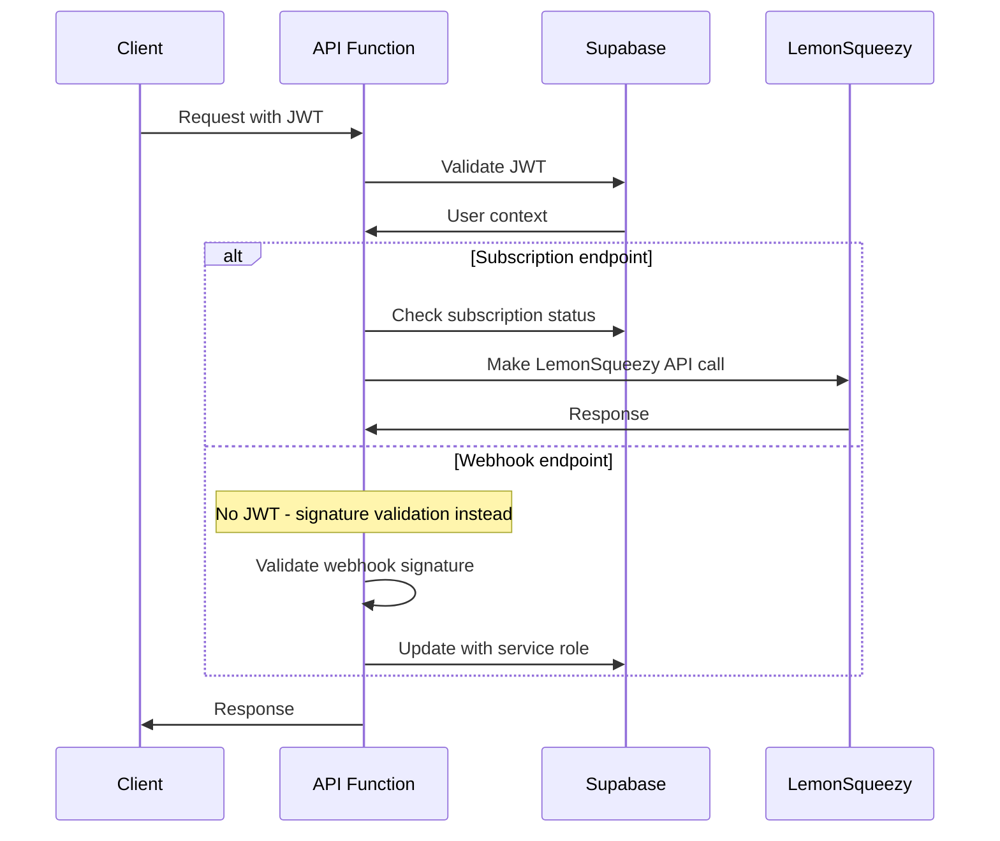

# Backend Architecture

### Service Architecture

#### Function Organization
```
api/
├── webhooks/
│   └── lemonsqueezy.ts        # New webhook handler
├── subscription/
│   ├── status.ts              # Get subscription status
│   ├── upgrade-url.ts         # Generate checkout URLs
│   ├── customer-portal.ts     # Get billing portal URLs
│   └── features.ts            # Get feature access
├── [existing functions]       # getData.ts, etc. (extended, not replaced)
└── lib/
    ├── subscription.ts        # Subscription business logic
    ├── lemonsqueezy.ts       # LemonSqueezy API client
    └── webhook-validator.ts   # Webhook signature validation
```

#### Function Template
```typescript
// api/webhooks/lemonsqueezy.ts - Core webhook handler
import { NextRequest, NextResponse } from 'next/server';
import { validateWebhookSignature } from '../lib/webhook-validator';
import { processSubscriptionWebhook } from '../lib/subscription';
import { createClient } from '@supabase/supabase-js';

export async function POST(request: NextRequest) {
  try {
    // Validate webhook signature
    const signature = request.headers.get('x-signature');
    const body = await request.text();
    
    if (!validateWebhookSignature(body, signature)) {
      return NextResponse.json(
        { error: 'Invalid signature' },
        { status: 401 }
      );
    }

    const webhook = JSON.parse(body);
    
    // Initialize Supabase client with service role
    const supabase = createClient(
      process.env.NEXT_PUBLIC_SUPABASE_URL!,
      process.env.SUPABASE_SERVICE_ROLE_KEY!
    );

    // Process webhook with idempotency check
    const result = await processSubscriptionWebhook(supabase, webhook);
    
    if (result.success) {
      return NextResponse.json({
        success: true,
        processed_at: new Date().toISOString()
      });
    } else {
      // Return 500 to trigger LemonSqueezy retry
      return NextResponse.json(
        { error: result.error },
        { status: 500 }
      );
    }
  } catch (error) {
    console.error('Webhook processing error:', error);
    return NextResponse.json(
      { error: 'Internal server error' },
      { status: 500 }
    );
  }
}
```

### Database Architecture

#### Data Access Layer
```typescript
// api/lib/subscription.ts - Business logic layer
import { SupabaseClient } from '@supabase/supabase-js';

export interface SubscriptionWebhookPayload {
  meta: {
    event_name: string;
    webhook_id: string;
  };
  data: {
    id: string;
    type: string;
    attributes: {
      user_email: string;
      status: string;
      ends_at?: string;
      // ... other LemonSqueezy fields
    };
  };
}

export async function processSubscriptionWebhook(
  supabase: SupabaseClient,
  webhook: SubscriptionWebhookPayload
): Promise<{ success: boolean; error?: string }> {
  
  // Check for duplicate processing (idempotency)
  const { data: existingWebhook } = await supabase
    .from('webhook_events')
    .select('id')
    .eq('webhook_id', webhook.meta.webhook_id)
    .single();

  if (existingWebhook) {
    return { success: true }; // Already processed
  }

  // Find user by email
  const { data: user, error: userError } = await supabase
    .from('users')
    .select('id')
    .eq('email', webhook.data.attributes.user_email)
    .single();

  if (userError || !user) {
    return { success: false, error: 'User not found' };
  }

  // Start transaction
  const { error: updateError } = await supabase.rpc(
    'update_user_subscription',
    {
      p_user_id: user.id,
      p_subscription_status: mapLemonSqueezyStatus(webhook.data.attributes.status),
      p_subscription_id: webhook.data.id,
      p_subscription_end_date: webhook.data.attributes.ends_at,
      // ... other fields
    }
  );

  if (updateError) {
    return { success: false, error: updateError.message };
  }

  // Log webhook event
  await supabase.from('webhook_events').insert({
    webhook_id: webhook.meta.webhook_id,
    event_type: webhook.meta.event_name,
    user_id: user.id,
    payload: webhook,
    processing_status: 'success'
  });

  // Trigger cache invalidation (integrate with your DataContext refresh)
  // This could be a Redis key deletion, database trigger, or pub/sub message
  await invalidateUserCache(user.id);

  return { success: true };
}

function mapLemonSqueezyStatus(lsStatus: string): string {
  const statusMap: Record<string, string> = {
    'active': 'active',
    'cancelled': 'cancelled', 
    'expired': 'cancelled',
    'past_due': 'past_due',
    'paused': 'paused',
    'unpaid': 'past_due'
  };
  
  return statusMap[lsStatus] || 'free';
}

async function invalidateUserCache(userId: string): Promise<void> {
  // Integration point with your DataContext caching system
  // This might involve:
  // - Redis cache key deletion
  // - Database timestamp update that DataContext checks
  // - WebSocket message to connected clients
  // - Simple: just rely on 5-minute cache expiry
}
```

### Authentication and Authorization

#### Auth Flow


#### Middleware/Guards
```typescript
// api/lib/auth.ts - Authentication middleware
import { NextRequest } from 'next/server';
import { createClient } from '@supabase/supabase-js';

export async function validateUser(request: NextRequest) {
  const authHeader = request.headers.get('authorization');
  
  if (!authHeader?.startsWith('Bearer ')) {
    throw new Error('Missing or invalid authorization header');
  }

  const token = authHeader.substring(7);
  
  const supabase = createClient(
    process.env.NEXT_PUBLIC_SUPABASE_URL!,
    process.env.NEXT_PUBLIC_SUPABASE_ANON_KEY!
  );

  const { data: { user }, error } = await supabase.auth.getUser(token);
  
  if (error || !user) {
    throw new Error('Invalid token');
  }

  return { user, supabase };
}

// Usage in subscription endpoints
export async function GET(request: NextRequest) {
  try {
    const { user, supabase } = await validateUser(request);
    
    // Get subscription status from database
    const { data: userData } = await supabase
      .from('users')
      .select('subscription_status, subscription_id, plan_id')
      .eq('id', user.id)
      .single();

    return NextResponse.json({
      status: userData?.subscription_status || 'free',
      isPremium: userData?.subscription_status === 'active',
      // ... other subscription fields
    });
  } catch (error) {
    return NextResponse.json(
      { error: 'Unauthorized' },
      { status: 401 }
    );
  }
}
```

