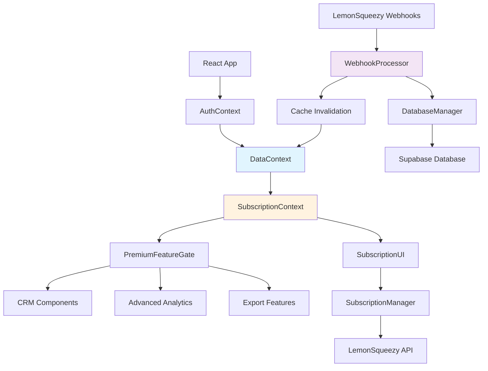

# Components

### WebhookProcessor

**Responsibility:** Processes LemonSqueezy webhook events and synchronizes subscription status with your database

**Key Interfaces:**
- `POST /api/webhooks/lemonsqueezy` - Receives webhook payloads
- Database update interface for user subscription fields
- Cache invalidation trigger for DataContext refresh

**Dependencies:** Supabase client, crypto module (signature validation), DataContext invalidation mechanism

**Technology Stack:** Vercel Function (TypeScript), Node.js crypto for webhook signature validation, Supabase SDK for database updates

### SubscriptionContext

**Responsibility:** Provides subscription state and feature access checking throughout your React application

**Key Interfaces:**
- `useSubscription()` hook - Returns current subscription status
- `usePremiumFeature(featureKey)` hook - Returns feature access state
- Context provider wrapping your existing DataContext consumption

**Dependencies:** DataContext (for cached subscription data), React Context API

**Technology Stack:** React Context, TypeScript, integrates with your existing context hierarchy

### PremiumFeatureGate

**Responsibility:** UI component that conditionally renders premium features with upgrade prompts for free users

**Key Interfaces:**
- `<PremiumFeatureGate feature="crm">` - Wraps premium components
- `onUpgradeClick` callback - Triggers LemonSqueezy checkout
- Preview mode rendering for locked features

**Dependencies:** SubscriptionContext, LemonSqueezy checkout URL generation, your existing UI components

**Technology Stack:** React component, Tailwind CSS (your existing styling), follows your component patterns

### SubscriptionManager

**Responsibility:** Handles subscription lifecycle operations like upgrades, downgrades, and cancellations

**Key Interfaces:**
- `generateCheckoutUrl(planId)` - Creates LemonSqueezy checkout links
- `getCustomerPortalUrl()` - Returns billing management URL
- `syncSubscriptionStatus()` - Manual refresh trigger

**Dependencies:** LemonSqueezy API, Supabase database, DataContext invalidation

**Technology Stack:** Vercel API functions, LemonSqueezy SDK, integrates with your existing API service layer

### DatabaseManager (Extended)

**Responsibility:** Your existing database access layer extended with subscription-aware RLS policies

**Key Interfaces:**
- Extended RLS policies on existing tables (flock_profiles, egg_entries, etc.)
- New webhook_events table management
- User subscription field updates

**Dependencies:** Supabase client, your existing database models

**Technology Stack:** Supabase PostgreSQL, RLS policies, extends your current database architecture

### SubscriptionUI

**Responsibility:** User interface components for subscription management, billing, and feature comparison

**Key Interfaces:**
- Subscription status dashboard in settings
- Feature comparison table for upgrades
- Billing history and payment method management

**Dependencies:** SubscriptionContext, SubscriptionManager, LemonSqueezy customer portal, your existing UI components

**Technology Stack:** React components, Tailwind CSS, follows your existing component library patterns

### Component Diagrams


