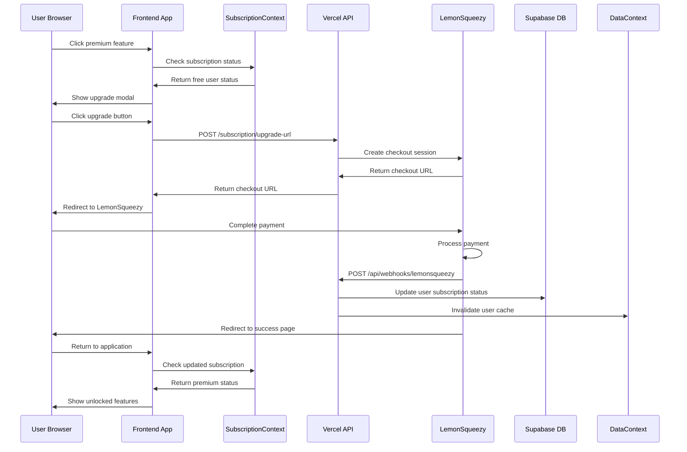
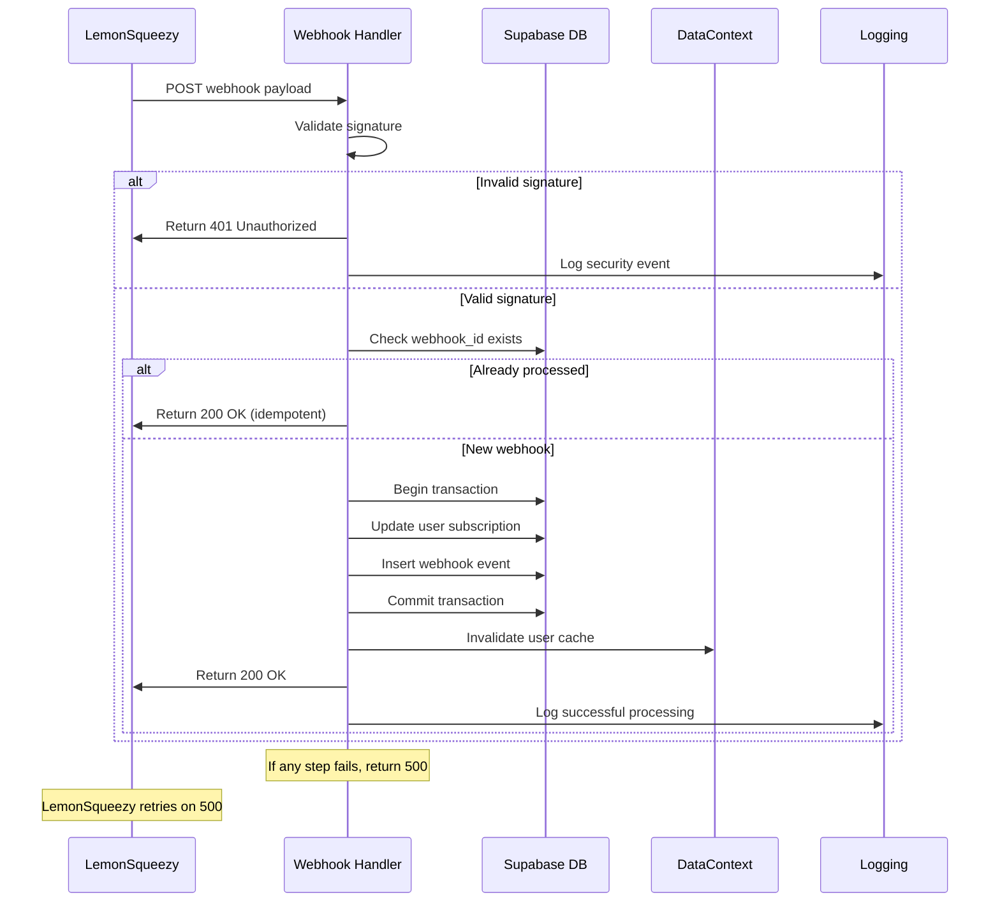
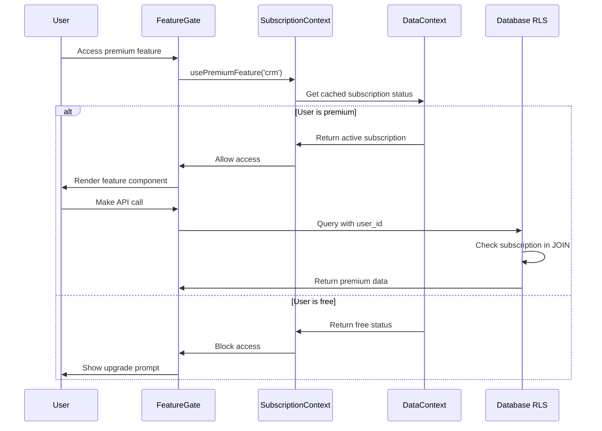

# Core Workflows

### Subscription Upgrade Flow

```mermaid
sequenceDiagram
    participant U as User Browser
    participant F as Frontend App
    participant S as SubscriptionContext
    participant API as Vercel API
    participant LS as LemonSqueezy
    participant DB as Supabase DB
    participant DC as DataContext

    U->>F: Click premium feature
    F->>S: Check subscription status
    S->>F: Return free user status
    F->>U: Show upgrade modal
    
    U->>F: Click upgrade button
    F->>API: POST /subscription/upgrade-url
    API->>LS: Create checkout session
    LS->>API: Return checkout URL
    API->>F: Return checkout URL
    
    F->>U: Redirect to LemonSqueezy
    U->>LS: Complete payment
    LS->>LS: Process payment
    
    LS->>API: POST /api/webhooks/lemonsqueezy
    API->>DB: Update user subscription status
    API->>DC: Invalidate user cache
    LS->>U: Redirect to success page
    
    U->>F: Return to application
    F->>S: Check updated subscription
    S->>F: Return premium status
    F->>U: Show unlocked features
```

### Webhook Processing Flow

```mermaid
sequenceDiagram
    participant LS as LemonSqueezy
    participant WH as Webhook Handler
    participant DB as Supabase DB
    participant DC as DataContext
    participant LOG as Logging

    LS->>WH: POST webhook payload
    WH->>WH: Validate signature
    
    alt Invalid signature
        WH->>LS: Return 401 Unauthorized
        WH->>LOG: Log security event
    else Valid signature
        WH->>DB: Check webhook_id exists
        
        alt Already processed
            WH->>LS: Return 200 OK (idempotent)
        else New webhook
            WH->>DB: Begin transaction
            WH->>DB: Update user subscription
            WH->>DB: Insert webhook event
            WH->>DB: Commit transaction
            
            WH->>DC: Invalidate user cache
            WH->>LS: Return 200 OK
            WH->>LOG: Log successful processing
        end
    end
    
    Note over WH: If any step fails, return 500
    Note over LS: LemonSqueezy retries on 500
```

### Feature Access Validation Flow

```mermaid
sequenceDiagram
    participant U as User
    participant FG as FeatureGate
    participant SC as SubscriptionContext
    participant DC as DataContext
    participant RLS as Database RLS

    U->>FG: Access premium feature
    FG->>SC: usePremiumFeature('crm')
    SC->>DC: Get cached subscription status
    
    alt User is premium
        DC->>SC: Return active subscription
        SC->>FG: Allow access
        FG->>U: Render feature component
        
        U->>FG: Make API call
        FG->>RLS: Query with user_id
        RLS->>RLS: Check subscription in JOIN
        RLS->>FG: Return premium data
    else User is free
        DC->>SC: Return free status
        SC->>FG: Block access
        FG->>U: Show upgrade prompt
    end
```

