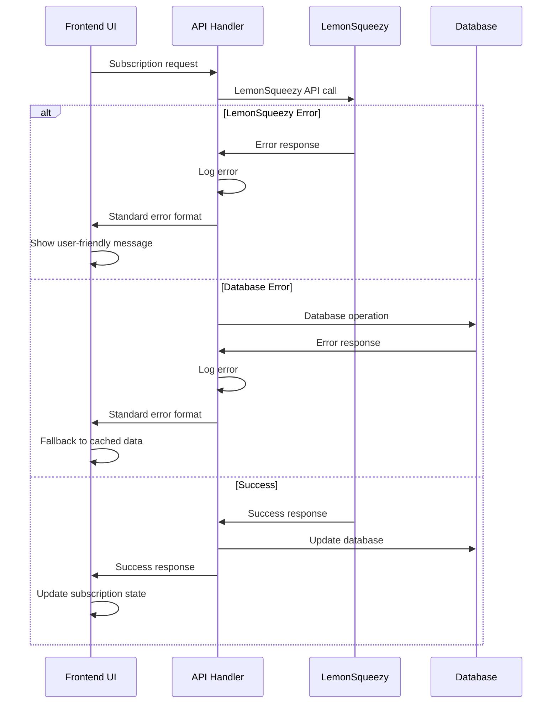

# Error Handling Strategy

### Error Flow


### Error Response Format
```typescript
interface ApiError {
  error: {
    code: string;
    message: string;
    details?: Record<string, any>;
    timestamp: string;
    requestId: string;
  };
}
```

### Frontend Error Handling
```typescript
// Frontend error boundary for subscription features
export const SubscriptionErrorBoundary: React.FC<{ children: React.ReactNode }> = ({ children }) => {
  return (
    <ErrorBoundary
      fallback={({ error }) => (
        <div className="subscription-error">
          <h3>Subscription Service Unavailable</h3>
          <p>Please try again later. Your existing features remain available.</p>
          <button onClick={() => window.location.reload()}>Retry</button>
        </div>
      )}
    >
      {children}
    </ErrorBoundary>
  );
};
```

### Backend Error Handling
```typescript
// Backend error handler for subscription endpoints
export function handleSubscriptionError(error: unknown): NextResponse {
  const requestId = crypto.randomUUID();
  
  console.error('Subscription error:', { error, requestId });
  
  if (error instanceof LemonSqueezyError) {
    return NextResponse.json({
      error: {
        code: 'LEMONSQUEEZY_ERROR',
        message: 'Payment service temporarily unavailable',
        timestamp: new Date().toISOString(),
        requestId
      }
    }, { status: 502 });
  }
  
  if (error instanceof DatabaseError) {
    return NextResponse.json({
      error: {
        code: 'DATABASE_ERROR', 
        message: 'Unable to process subscription request',
        timestamp: new Date().toISOString(),
        requestId
      }
    }, { status: 500 });
  }
  
  return NextResponse.json({
    error: {
      code: 'INTERNAL_ERROR',
      message: 'An unexpected error occurred',
      timestamp: new Date().toISOString(),
      requestId
    }
  }, { status: 500 });
}
```

