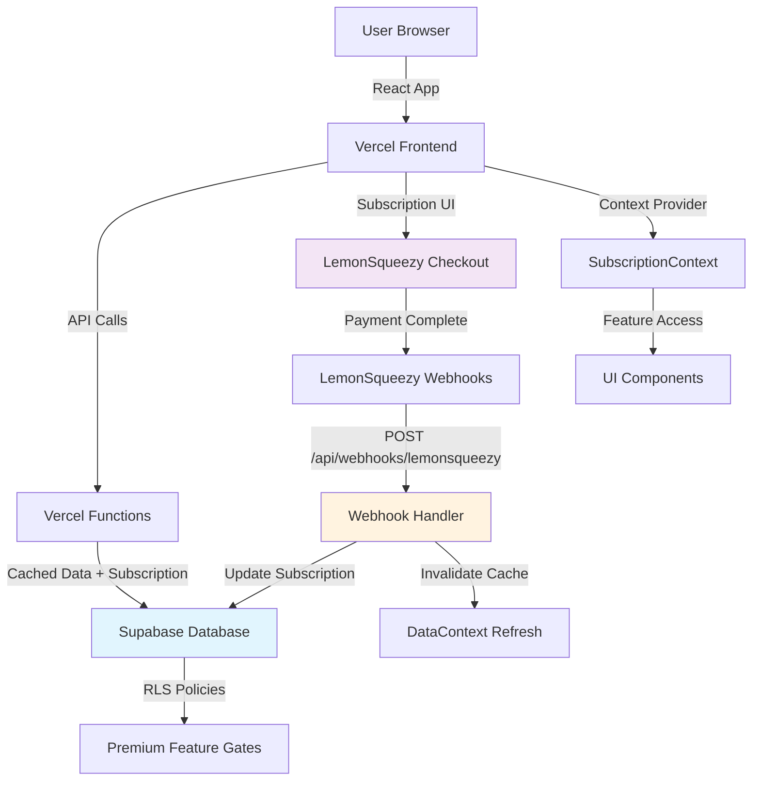

# High Level Architecture

### Technical Summary

The LemonSqueezy subscription system extends your existing React/Supabase/Vercel architecture with serverless webhook processing, database-level feature gating via RLS policies, and React Context-based subscription state management. The system leverages your current DataContext caching patterns to ensure subscription checks have zero performance impact, while webhook processing provides real-time subscription synchronization through Vercel serverless functions. Premium feature authorization occurs at both the UI component level and database RLS level, creating defense-in-depth security that prevents unauthorized access regardless of client-side manipulation. This architecture maintains your existing authentication flows and user data isolation while adding transparent subscription management that scales with your current infrastructure patterns.

### Platform and Infrastructure Choice

**Platform:** Vercel + Supabase (Extended Current Stack)  
**Key Services:** Vercel Functions (webhooks), Supabase RLS (feature gating), LemonSqueezy (payments)  
**Deployment Host and Regions:** Vercel Edge (existing), Supabase US-East (existing)

### Repository Structure

**Structure:** Monorepo (Current)  
**Monorepo Tool:** NPM workspaces (existing)  
**Package Organization:** Extend existing structure with subscription modules in current api/ and src/ directories

### High Level Architecture Diagram

### Architectural Patterns

- **Serverless Webhook Processing:** Vercel functions handle LemonSqueezy webhooks - _Rationale:_ Fits your existing serverless architecture and scales automatically
- **Extended DataContext Pattern:** Subscription status integrated into existing cache - _Rationale:_ Maintains consistent performance patterns and development familiarity  
- **Database-Level Feature Gating:** RLS policies enforce subscription access - _Rationale:_ Provides backend security that can't be bypassed by client manipulation
- **React Context State Management:** Subscription state via existing context patterns - _Rationale:_ Leverages your proven state management approach
- **Progressive Enhancement:** Free users see previews, subscribers get full access - _Rationale:_ Maximizes conversion while maintaining user experience
- **Defense in Depth:** UI gates + API validation + RLS policies - _Rationale:_ Multiple layers prevent unauthorized premium feature access

